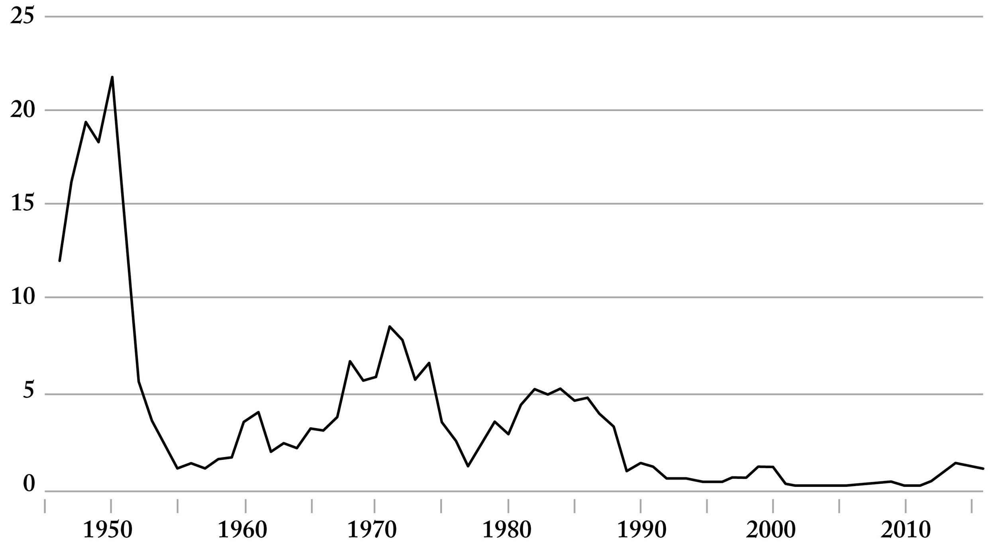
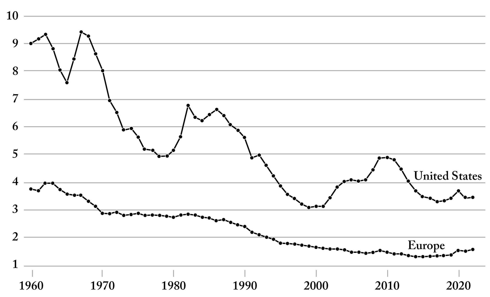
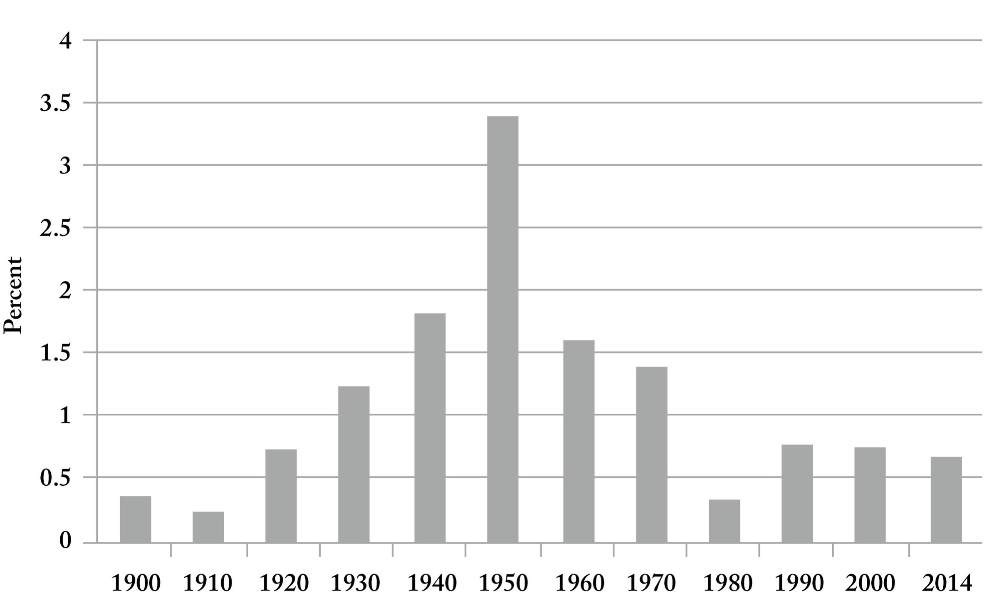

::: page_top_padding
[•]{.char-ccust4}

## []{#page_37 .pagebreak epub:type="pagebreak" role="doc-pagebreak" title="37"}第四章 {#chapter-four .para-cn-chap-pg}

## [原子时代的终结]{.char-ccust50} {#end-of-the-atomic-age .para-ct}

1945年7月16日，拂晓前的黑暗中，一群科学家和政府官员聚集在新墨西哥州沙漠中一片荒凉的沙地上，见证人类首次核武器试验。前一天晚上下了雨，试验能否进行尚不确定。然而，那天清晨雨停了。罗伯特·奥本海默和万尼瓦尔·布什都在场。一位观察者将爆炸描述为“灿烂的紫色”，炸弹爆炸的雷声似乎在沙漠中回荡并久久不散。那天早上在新墨西哥州，奥本海默思考了这种具有毁灭性力量的新时代是否可能以某种方式促成持久和平的可能性。几十年后美国能源部的一份政府报告指出，奥本海外交官回忆起那天早上，瑞典实业家和慈善家阿尔弗雷德·诺贝尔的希望，他发明的炸药“将结束战争”。

诺贝尔于1833年出生于斯德哥尔摩，他在19世纪后期通过试验一种新型爆炸性硝化甘油而发家致富，并将其出售给欧洲各地的矿工，包括德国和比利时，以及前往美国落基山脉以西寻找黄金的探险家。然而，这种工业化学品很快被军事工程师用于制造炸弹。例如，根据诺贝尔的传记作家伊迪丝·帕特森·迈耶的说法，在19世纪70年代初，炸药在法国和普鲁士之间的战争中被广泛使用，这场战争将阿尔萨斯-洛林交给了德国。起初，诺贝尔打算让他的发明仅用于“和平目的”，迈耶讲述道。然而，随着时间的推移，他的思想变得越来越务实，因为他最初对发明的理想主义和对知识纯洁的渴望似乎已经消退。1891年，在巴黎生活期间，诺贝尔在一封给朋友的信中吐露，更有能力的武器，而不是更少，将是和平的最佳保障。“唯一能阻止各国发动战争的是恐怖，”他写道。

我们可能会本能地回避这种冷酷的算计，转而希望我们物种本质上和平的本能会占上风，只要那些拥有武器的人愿意冒险放下武器。然而，自新墨西哥州首次原子弹试验以来，已经过去了近八十年，核武器在战争中仅使用过两次，分别是在日本的广岛和长崎。对于许多人来说，原子弹所带来的威力和恐怖已经变得遥远而模糊，几乎是抽象的。前往日本报道袭击事件的美国记者约翰·赫西指出，广岛使用的原子弹在一瞬间夺去了近10万人的生命，并将数千人送往该市只有600张床位的主要医院。毁灭是彻底和完全的。赫西写道，火光在一些妇女的身体上留下了花朵形状的图案——她们和服的黑白布料反射了爆炸的热量。

在日本使用原子武器只是对该国平民进行同样残酷无情攻击的最后一幕。几个月来，包括波音公司制造的四引擎B-29轰炸机在内的美国战机用燃烧弹轰炸了从东京到名古屋的城市。他们的目的是夷平建筑物并杀死平民，希望迫使日本军方在其横扫太平洋之后投降——这场进军导致数百万人死亡。这是一个黑暗的逻辑，关于对日本和德国进行不分青红皂白的全面轰炸，更不用说使用核武器的必要性的辩论，至今仍在继续，这是理所当然的。“我们讨厌我们正在做的事情，”一名1945年3月在东京上空驾驶B-29轰炸机的美国飞行员后来在一次采访中回忆道。“但我们认为我们必须这样做。我们认为那次空袭可能会导致日本人投降。”[\[\*1\]](Karp_9780593798706_epub3_c004_r1.xhtml#_footnote_d1-00015e85 "footnote"){#_footnote_referrer_d1-00015e85 .char-fnref .footnote_ref .noteref epub:type="noteref" role="doc-noteref"}

美国的战略是一种新型战争的产物，这种战争不区分战场上的战斗人员和在工厂和田野里工作的平民。1935年，第一次世界大战期间德国军队的将军埃里希·鲁登道夫，后来他将挑战保罗·冯·兴登堡竞选该国总统，在阿道夫·希特勒巩固对德国国家政府的控制时，写到了“总体战”，即 *der totale Krieg*。鲁登道夫在德国精英中是一个备受尊敬的人物。1917年，H. L. 孟肯在为《大西洋月刊》撰写的一篇发自柏林的电讯中写道，德国军方的一些成员将这位将军描述为“蛇，天才”，并指出他善于“将手指伸入众多遥远而微小的事务中”。对于鲁登道夫来说，在这种新型军事冲突的逻辑下，“人民本身”理应“受到战争的直接行动”，因此被视为合法的攻击目标。

然而，自日本爆炸事件以来的八十年里，核武器再也没有在战争中使用过。人类对奥本海默等人创造的武器的管理记录——不完美，而且确实有几十次近乎灾难性的——是了不起的，而且常常被忽视。太多人忘记了，或者想当然地认为，近一个世纪以来，某种形式的和平在世界上盛行，没有大国之间的军事冲突。至少三代人——数十亿人以及他们的子孙后代——从未经历过世界大战。原子时代和冷战基本上巩固了大国之间的关系，使得真正的升级，而不是地区冲突边缘的小规模冲突和实力考验，变得极不具吸引力且代价高昂。耶鲁大学军事和海军历史教授约翰·刘易斯·加迪斯将战后时代缺乏重大冲突描述为“长期和平”。近四十年前，在1987年，加迪斯指出，二战结束后几十年来相对和平的持续时间和持久性是“本世纪大国关系中最长的稳定时期”，甚至可以与“所有现代史上”类似的相对平静时期相媲美。如今，一个更长的和平记录，接近一个世纪，更加引人注目。史蒂芬·平克在其2011年出版的《我们本性中更好的天使》一书中认为，近期缺乏广泛冲突和“暴力的减少可能是我们物种历史上最重要但最不被重视的发展”。

{#page_40_img1 .fill}

将如此持久的世界历史相对安宁时期的全部或大部分功劳归于单一武器是不合理的。自二战结束以来的任何其他发展，包括民主政体在地球上的扩散和曾经难以想象的相互关联的经济活动水平，无疑都是故事的一部分。而且，在很大程度上鼓励不愿冒直接冲突风险的微妙力量平衡也可能迅速改变。然而，在过去一个世纪里，美国军事力量的至高无上无疑有助于维护当前虽然脆弱的和平。然而，致力于维持这种至高无上的承诺在西方变得越来越不合时宜。而且，作为一种学说，威慑正面临失去其道德吸引力的风险。

---

::: {.para-orn aria-hidden="true"}
• • •
:::

在一段时间里，暗示欧洲在自身防务上花费不足被认为是不必要的挑衅和近乎不礼貌的——即欧洲大陆基本上受益于美国每年约9000亿美元的巨额国家安全投资，而没有分担其成本。几十年来，美国一直将其GDP的约3%至5%用于国防，而欧盟的军事开支在同一时期徘徊在1.5%左右。

近年来，对欧洲做法的更尖锐批评，即其对美国的巨大依赖，变得越来越频繁。2016年4月，巴拉克·奥巴马总统在接受《大西洋月刊》杰弗里·戈德堡采访时，对欧洲国防开支的疲软表示失望。“搭便车的人让我恼火，”奥巴马说。当时，英国和几乎所有欧洲邻国一样，国防开支不到其GDP的2%——奥巴马告诉英国首相戴维·卡梅伦，如果英国想维持其引以为傲的“特殊关系”，就必须达到这个门槛。“你必须支付你应付的份额，”奥巴马警告卡梅伦。

{#page_42_img1 .fill}

欧盟外交与安全政策高级代表何塞普·博雷利指出，自20世纪90年代初以来，欧洲在国防投资方面出现了更广泛、更结构性的退缩。“冷战后，我们将我们的军队缩减为盆景军队，”博雷利说。欧洲国防开支和采购方式支离破碎的影响是巨大的，近三十个国家的采购机器在整个欧洲大陆和世界范围内采用不同的战略和不同的供应商。“欧洲的盆景军队培育了盆景产业，”德国外交关系委员会的克里斯蒂安·默林在2024年接受《经济学人》采访时表示。

对于1949年建立北大西洋公约组织（NATO）的创始人来说，作为西方联盟的基石，欧洲在二战结束近八十年后对发展强大的自卫手段不感兴趣，将被视为一个显著的失败。1951年2月，德怀特·D·艾森豪威尔总统在给他的朋友、雷曼兄弟芝加哥业务负责人爱德华·J·伯明翰的一封信中，表达了希望欧洲能迅速发展自己的能力，在必要时用武力捍卫其利益。正如艾森豪威尔所说，挑战在于“如何激励欧洲为自己生产那些武装力量，从长远来看，这些武装力量必须是保卫欧洲的唯一手段。”他补充说，美国“不能成为一个用我们自己的军团保卫遥远边疆的现代罗马”。

当然，对进一步军事投资的抵制在德国尤其普遍。小说家、《铁皮鼓》的作者君特·格拉斯曾著名地反对东西德统一，理由是一个统一的国家会增加另一个奥斯威辛的可能性。1991年，他写道：“任何东西，无论多么田园诗般的民族意识，无论多么晚生的仁慈保证，都无法改变或消除我们这些罪犯和我们的受害者作为一个统一的德国所经历的体验。”然而，在过去半个世纪里，这个国家的阉割已经产生了后果。一个强大而自信的德国的退却无疑促成了俄罗斯在2022年2月入侵乌克兰。弗拉基米尔·普京正确地计算出他不会为此付出重大代价。经过几十年的自我鞭笞，德国的军队已经退化成一个实际武装力量的漫画形象。

日本也同样如此。该地区最富裕的民主国家今天仍然需要美国的援助才能击退甚至在真正的入侵中幸存下来。1947年，在日本军队向盟军投降后，该国通过了一项全面禁止为进攻目的维持军队的禁令。该国宪法第9条规定，“日本人民永远放弃作为国家主权权利的战争和作为解决国际争端手段的武力威胁或使用”，因此，“陆、海、空军以及其他战争潜力将永远不会维持。”这项规定今天在技术上仍然是该国的法律，实际上要求其他国家，包括美国，在该国受到攻击时保卫它。

错误不在于解散日本帝国军队并在战后立即制定法律保障措施以防止其复活。而是在四分之三个世纪里，在世界秩序重塑的过程中，包括一个自信而有能力的中国的崛起以及一个重新雄心勃勃的俄罗斯的出现，仍然维持同样的政策。德国的去势是一个过度修正，欧洲现在正为此付出沉重代价。如果继续维持对日本和平主义的类似且高度戏剧化的承诺，也将威胁到亚洲的力量平衡。包括战场人工智能在内的新技术出现的好处在于，它们为各国提供了快速转向的机会，但前提是它们的领导人能够动员公众意愿做好战斗准备。

---

::: {.para-orn aria-hidden="true"}
• • •
:::

F-35战斗机于20世纪90年代中期构思，这架由洛克希德·马丁公司制造的美国及其盟军的旗舰攻击机计划将再服役六十三年。根据美国政府的数据，该计划的总成本目前估计为2万亿美元。但正如前参谋长联席会议主席马克·米利将军在2024年华盛顿特区的一次国家安全会议上所说：“我们真的认为到2088年，有人驾驶的飞机还能赢得天空吗？”

原子时代即将结束。这是软件的世纪，未来的决定性战争将由人工智能驱动，其发展时间表与过去的武器截然不同，而且速度更快。硬件和软件之间的关系正在发生根本性的逆转。在二十世纪，软件是为了维护和满足硬件的需求而构建的，从飞行控制到导弹航空电子设备，从燃料系统到装甲运兵车。然而，随着人工智能的兴起以及在战场上使用大型语言模型来处理数据并提出目标建议，这种关系正在发生变化。软件现在处于主导地位，而硬件——欧洲及其他地区战场上的无人机——越来越成为人工智能建议在世界上实施的手段。能够以常规武器成本的一小部分瞄准并杀死对手的无人机群即将到来。然而，对此类技术以及其运行所需的软件系统的投资水平还远远不够。美国政府仍然专注于发展传统基础设施——飞机、舰船、坦克和导弹——这些在上一世纪的战场上取得了主导地位，但在本世纪几乎肯定不会那么重要。

美国国防部在2024年申请了总计18亿美元的资金用于人工智能能力，仅占该国8860亿美元拟议国防预算总额的0.2%——即1%的五分之一。而对于那些在武力使用方面比其对手持有更高道德标准的国家来说，即使与敌人技术均等也是不够的。一个掌握在有道德的社会手中，并且理所当然地对其使用持谨慎态度的武器系统，只有当它比一个会毫不犹豫地杀害无辜者的对手的能力强大得多时，才能起到有效的威慑作用。

美国及其海外盟友应毫不拖延地致力于启动一个新的曼哈顿计划，以保留对战场上最先进人工智能形式的独家控制权——这些瞄准系统、无人机群以及最终将成为本世纪最强大武器的机器人。定义上一个时代战争的航空母舰和战斗机将成为软件的附属品——日益智能化的系统在世界上行使权力的手段。我们的国防预算以及负责监督它的庞大人事队伍已经过时了几十年。必须立即发起一项紧急努力，将我们国家安全投资的重点转移，将美国及其在欧洲和亚洲的伙伴聚集在一起。

挑战在于，最有能力构建本世纪威慑力量的人工智能系统的硅谷新兴工程精英，也对为美国军方工作最为矛盾。整整一代有能力构建下一代人工智能武器的软件工程师已经背弃了民族国家，对地缘政治的混乱和道德复杂性不感兴趣。虽然近年来出现了一些支持国防工作的零星力量，但绝大多数资金和人才继续流向消费领域。技术阶层本能地急于为视频分享应用和社交媒体平台、广告算法和在线购物网站筹集资金。他们毫不犹豫地跟踪和货币化我们在网上的每一个举动，深入我们的生活。然而，正是这些工程师以及他们建立的硅谷巨头，在被要求与美国军方合作时常常退缩。当然，具有讽刺意味的是，那些反对与美国军方合作的硅谷人士所享有的和平与自由，正是由同一支军队可信的武力威胁所保障的。

这种一代人对民族国家的幻灭和对我们集体防御的漠不关心，其风险在于导致了资源（包括智力资源和财政资源）的毫无疑问但大规模的重新分配，以满足资本主义消费文化往往反复无常的需求。我们文化雄心的丧失，以及我们对技术部门生产对公众具有持久和集体价值的产品的要求越来越低，已经将过多的控制权让给了市场的奇想。正如曾在耶鲁大学和伦敦经济学院教授文化人类学的大卫·格雷伯在2012年发表在《Baffler》上的一篇文章中所观察到的那样，“互联网是一项了不起的创新，但我们所谈论的只是一个超高速且全球可访问的图书馆、邮局和邮购目录的组合。”他和其他许多人都渴望更多。

2022年11月，当投入数十亿美元开发ChatGPT等大型语言模型的OpenAI首次向公众发布其人工智能界面时，该公司的政策禁止将其技术用于“军事和战争”目的，这是对那些对与派往危险地带保卫国家的士兵有任何瓜葛持谨慎态度的人的广泛让步。2024年初，该公司改变了方针，取消了对军事应用的全面禁令后，抗议者迅速聚集在旧金山首席执行官萨姆·奥尔特曼的办公室外，抗议组织者要求OpenAI“结束与五角大楼的关系，不接受任何军事客户”。构建驱动ChatGPT（一种在计算智能解决问题方式上取得惊人进步的语言模型）的工程师们，非常乐意将他们创造的力量借给销售消费品的公司，但在被要求为美国陆军和海军提供更有效的软件时却犹豫不决。

这种来自人群的抗议和愤怒的威胁在于，它塑造和影响了整个科技行业领导者和投资者的直觉，他们中的许多人被训练成系统地避免任何争议或不赞成的迹象。而这种回避的代价——以及该行业几乎完全屈服于市场的奇想，以决定*应该*建造什么，而不仅仅是*可以*建造什么——是巨大的。

2018年，麻省理工学院媒体实验室联合创始人尼古拉斯·尼葛洛庞帝在《设计与科学杂志》上发表了一篇题为《大创意饥荒》的文章，其中提到了当今“专注于为我们洗衣服、送餐或用另一个应用程序娱乐自己的轻率方式”的大量初创公司。他补充说，挑战在于“新技术、真正的发现以及科学和工程领域的发明往往在初创过程中被琐碎化，以满足投资者的期望。”许多企业家和才华横溢的工程师大军干脆把难题搁置一旁。这种雄心的退却与经济学家罗伯特·J·戈登所认为的过去四分之三个世纪以来美国社会生产率增长率的显著下降相吻合。正如戈登所写，自1970年以来的几十年里，技术发展“主要发生在与娱乐、通信以及信息收集和处理有关的狭窄活动领域”，而“对于人类关心的其他方面——食物、衣服、住所、交通、健康以及家庭内外的劳动条件——进步已经放缓。”

{#page_48_img1 .fill}

科技行业雄心壮志的普遍退却也有例外。例如，埃隆·马斯克创立了两家公司，特斯拉和SpaceX等，它们挺身而出，填补了国家政府退缩后留下的明显创新空白。开发可靠的内燃机替代品以及向外太空发射火箭的挑战，在另一个时代本应是政府舒适且合乎逻辑的领域。应对此类挑战所需的资源是巨大的。然而，愿意冒着资本或声誉风险去尝试解决这些问题的人却寥寥无几。文化界几乎对马斯克对宏大叙事的兴趣嗤之以鼻，仿佛亿万富翁就应该安分守己地致富，或许偶尔为名人八卦专栏提供点素材。2023年《纽约客》上的一篇关于马斯克的简介文章暗示，世界上少一些“超级富豪的奢侈星球建造者”会更好，并谴责他“似乎与人类本身疏远了”。[\[\*2\]](Karp_9780593798706_epub3_c004_r1.xhtml#_footnote_d1-00015e8c "footnote"){#_footnote_referrer_d1-00015e8c .char-fnref .footnote_ref .noteref epub:type="noteref" role="doc-noteref"} 多年来，许多人相信SpaceX的可重复使用火箭是“一个愚蠢的差事”，而马斯克“完全是在浪费时间”，根据这位创始人2015年的一本传记。任何对他所创造的价值的好奇心或真正兴趣基本上都被忽略了，或者也许潜藏在一种薄薄的轻蔑面纱之下。具有讽刺意味的是，许多最强烈地声称反对资本主义过度行为的人，往往是第一个站出来抨击那些有胆量尝试建造市场未能提供的东西的人。需要的是更多的雄心和更严肃的目标感，而不是更少。例如，iPhone是我们文明最伟大的创造性成就，如果不是登峰造极的成就的话？这个物体改变了我们的生活，但它现在也可能正在限制和束缚我们对可能性的感觉。正如彼得·蒂尔在2011年的一次采访中所观察到的那样，阿波罗太空计划的激进和不连续的飞跃，而不是消费电子产品能力的渐进式进步，应该成为我们评判自己和评估人类进步的标准。

一代新兴的创始人表示，他们积极寻求风险，但当涉及到公共关系和对更重大的社会挑战进行更深入的投资时，谨慎往往占上风。当你能再建一个应用程序时，为什么要冒着进入地缘政治的道德泥潭和招致争议的风险呢？

他们确实建造了应用程序。社交媒体帝国在美国的扩散，系统地将人类对地位和认可的渴望货币化和引导，掠夺和编程年轻人，让他们在同龄人往往反复无常的喜爱和认可中找到回报，已经将整个文明的努力和资源过多地重新导向。2022年，YouTube从针对12岁以下3140万儿童的广告中获利9.59亿美元。Instagram在一年内从同一年龄段获利8.01亿美元。我们必须奋起反抗这种对我们文化和资本的误导。让我们不要温和地走进那个良夜。[\[\*3\]](Karp_9780593798706_epub3_c004_r1.xhtml#_footnote_d1-00015e8f "footnote"){#_footnote_referrer_d1-00015e8f .char-fnref .footnote_ref .noteref epub:type="noteref" role="doc-noteref"}

---

::: {.para-orn aria-hidden="true"}
[]{#page_51 .pagebreak epub:type="pagebreak" role="doc-pagebreak" title="51"} • • •
:::

无论我们是否这样做，我们的对手都将继续发展用于战场的的人工智能。专制政权的领导人如果失去控制，很可能会丧命。中国国家主席习近平出生于1953年，即该国共产主义革命结束四年后。十五岁时，他被送到陕西省西安东北部的梁家河村，在那里他住在一个窑洞里，被迫在田里劳动，根据他青年时期的一段记述。“他像我们其他人一样吃苦，”一位在那些早年认识习近平的农民在2012年告诉一家报纸。那是一个巨大的社会动荡时期。习近平的姐姐和平可能在红卫兵手中自杀，红卫兵是毛泽东最初为支持他的革命而召集的学生和其他人，然后在1960年代手忙脚乱地加以控制。一份官方政府的记述几乎没有透露什么，只提到和平被“迫害致死”。正如一位国际关系教授在2022年接受《纽约客》的埃文·奥斯诺斯采访时解释的那样，许多经历过文化大革命的习近平的同代人“得出结论，中国需要宪政和法治，但习近平说不：你需要利维坦。”培养硬实力，包括用于战场的人工智能，是生存的必要条件。习近平对此的理解方式是西方那些自诩为历史胜利者的人常常忘记的。

美国外交政策机构在与中国、俄罗斯和其他国家打交道时一再失算，认为仅凭经济一体化的承诺就足以削弱其领导层在国内的支持，并减少其在国外进行军事升级的兴趣。达沃斯共识，即主流的国际关系处理方式，其失败之处在于放弃了棍棒，只剩下胡萝卜。安妮·阿普尔鲍姆正确地提醒我们，“自然的自由世界秩序”并不存在，尽管我们有最热切的愿望，而且“没有执行者就没有规则”。习近平和其他人以一种我们西方当前大多数政治领导人永远无法理解的方式运用和保留了权力。我们的错误在于希望专制政权在与我们自己的政权有足够的接近和鼓励的情况下，会意识到自己的错误。但正如亨利·基辛格所观察到的那样，“西方的制度并非从同时代人的头脑中一蹴而就，而是经过几个世纪的演变。”

我们绝不能对调查我们对手的心理和世界观，对了解他们运作的限制、他们维持控制所面临的风险、他们的个人抱负以及对他们人民的期望失去兴趣。几十年来，习近平和他的家人一直对美国表现出好奇和兴趣。1985年，他作为中国代表团的一员在爱荷华州马斯卡廷度过了一段时间，住在一个当地家庭的家里。而习近平唯一的女儿习明泽于2014年5月毕业于哈佛大学，她使用化名学习英语和心理学。一家日本报纸的记者说，她在校期间，知道明泽真实身份的人不到十个。

2015年访问美国时，习近平在西雅图发表演讲，回忆起他年轻时读过亨利·戴维·梭罗、沃尔特·惠特曼和马克·吐温的作品。欧内斯特·海明威给他留下了特别深刻的印象，习近平深情地回忆起《老人与海》。当习近平访问古巴时，他告诉听众，他去了科希马尔，一个位于哈瓦那市中心北部海岸的地区，那里为海明威关于一个渔夫和他十八英尺长的马林鱼的故事提供了灵感。在后来的一次旅行中，习近平提到他“点了一杯莫吉托”，这是作者最喜欢的饮料，“加了薄荷叶和冰块”。习近平解释说，他“只是想亲身感受一下”海明威在“写那些故事”时的想法和他所处的地方。这个拥有世界近五分之一人口的国家的领导人补充说，“努力深入了解与我们自己不同的文化和文明非常重要”。我们最好也这样做。

---

::: {.para-orn aria-hidden="true"}
• • •
:::

美国及其盟友不愿继续开发更有效、更自主的军事武器系统，可能源于对权力本身和胁迫的正当怀疑——历史胜利者对进一步投资战争机器的厌恶。和平主义的吸引力在于它满足了我们对无权者的本能同情。但正如法国作家、前总理顾问克洛伊·莫林在最近的一次采访中所建议的那样，我们或许应该抵制那种“将世界划分为主导者和被主导者、压迫者和被压迫者”的轻率冲动。用英国约克大学教授雷米·阿德科亚的话来说，这种“道德二元论”让许多人感到不舒服，因为它谴责对那些在某些领域占据权力地位的人的伤害。然而，系统地将无权等同于虔诚将是一个错误，实际上是一种道德上的居高临下。被征服者和征服者同样有能力犯下严重的罪行。然而，我们仍然固守着劳伦斯·H·基利在1996年出版的《文明之前的战争》中所描述的“和平的过去”的危险而普遍的神话，他在书中叙述了前工业社会中常常残酷的暴力历史，从北美大平原的夏延人到新几内亚的达尼人。例如，基利指出，一些美洲平原的土著部落“以特有的方式肢解敌人的尸体，作为一种‘签名’：苏族人割喉，夏延人砍臂，阿拉帕霍人劈鼻。”而印度尼西亚的达尼人则在箭头上涂抹泥土或油脂，以增加被射中者感染的机会。

这种道德逻辑的根源很深，可能难以根除。1968年，巴西作家保罗·弗莱雷出版了《被压迫者的教育学》，他在书中阐述了一种压迫者与被压迫者的逻辑，这种逻辑在半个世纪后仍然构建着我们的知识和道德话语。他的一个核心主张是，世界上被压迫的人民，即下层阶级，基本上没有能力自己施暴，或者说压迫本身。他剥夺了被剥夺者的道德能动性。“历史上，暴力从来不是由被压迫者发起的，”他写道。“发起恐怖的不是无助的、受恐怖支配的人，而是暴力的人。”对他来说，世界上被征服的人民基本上没有能力自己去伤害他人，只能成为受害者。但是，这种将如此全面和完整的身份强加给据称无权者的还原论坚持，可能会产生意想不到的后果，即剥夺他们的道德能动性，甚至他们的人性。

和平主义的诱惑，以及可能从威慑中退却，在于它使我们不必在世界呈现的困难和不完美的权衡中进行选择。我们面临的更广泛的问题不是是否会建造新一代日益自主的、融合了人工智能的武器。而是谁将建造它们，以及为了什么目的。这是软件的世纪，然而我们的挑战是，最有能力、最适合构建下一波进攻性能力的一代人，也最满足于从涉及国防或共同目标的项目中退却。正是这种美国思想的空洞化——不仅仅是在硅谷，我们将在下一章看到——导致我们陷入了目前的僵局。也正是这种美国项目的空-洞化使我们变得脆弱和暴露。
:::

::: {#d1-d2s8d3s5_footnotes .footnotes .footnotes epub:type="footnotes"}
[跳过注释](Karp_9780593798706_epub3_p002_r1.xhtml)

::: {#_footnote_d1-00015e85 .footnote .footnote epub:type="footnote" role="doc-footnote"}
[[\*1](Karp_9780593798706_epub3_c004_r1.xhtml#_footnote_referrer_d1-00015e85 "footnote reference"){.footnote role="doc-backlink"} ]{.footnoteNum}一些人认为，美国领导人甚至在1945年当时就相信，即使不使用原子武器，日本帝国也会崩溃。例如，参见加尔·阿尔佩罗维茨，“广岛：历史学家重新评估”，《外交政策》，第99期（1995年夏季）：15。
:::

::: {#_footnote_d1-00015e8c .footnote .footnote epub:type="footnote" role="doc-footnote"}
[[\*2](Karp_9780593798706_epub3_c004_r1.xhtml#_footnote_referrer_d1-00015e8c "footnote reference"){.footnote role="doc-backlink"} ]{.footnoteNum}[]{#Y_d1-EndnotePhraseInText128}用西奥多·罗斯福的话来说，马斯克的批评者往往远离竞技场——“那些既不知道胜利也不知道失败的冷酷而胆怯的灵魂”。
:::

::: {#_footnote_d1-00015e8f .footnote .footnote epub:type="footnote" role="doc-footnote"}
[[\*3](Karp_9780593798706_epub3_c004_r1.xhtml#_footnote_referrer_d1-00015e8f "footnote reference"){.footnote role="doc-backlink"} ]{.footnoteNum}我们将注意力和资源误导到这些努力上，并非出于某种邪恶的阴谋，而是由于掌舵者意志和想象力的失败。作为一个国家，我们应该采取行动，例如，建立一个技术和平队——一个机构，通过它，那些好奇而有才华的工程人才的努力，否则可能会被用来进一步完善在线广告算法，可以转而用于解决美国国内外教育、医疗、国防和基础科学领域明显的创新差距。
:::
:::
