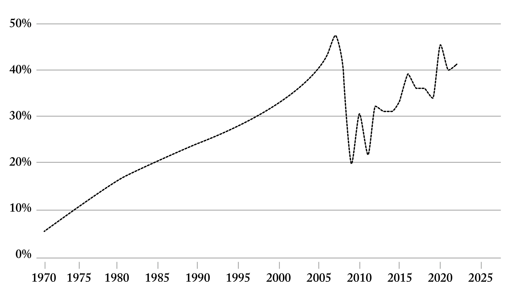
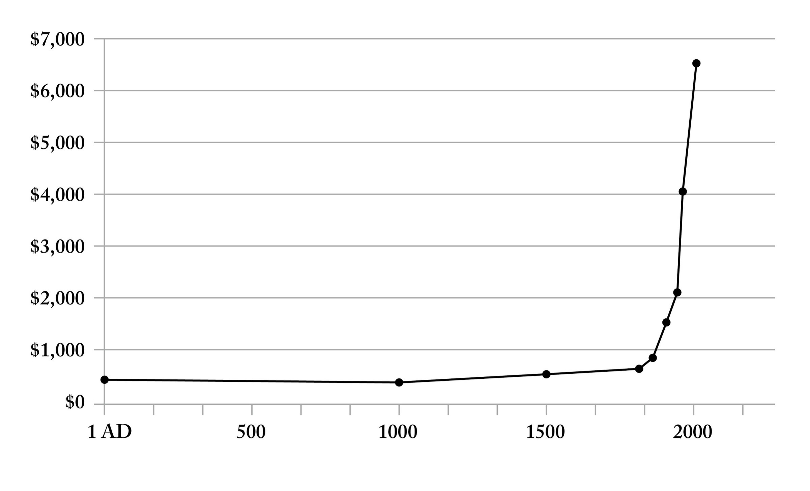

::: page_top_padding
[•]{.char-ccust4}

## []{#page_69 .pagebreak epub:type="pagebreak" role="doc-pagebreak" title="69"}第六章 {#chapter-six .para-cn-chap-pg}

## [技术不可知论者]{.char-ccust50} {#technological-agnostics .para-ct}

T[[he current leaders of ]{.fv-allsmallcaps}]{.char-first}硅谷，那些构建了我们现在生活所依赖的技术帝国的领袖们，他们大多在一个名义上尊崇正义要求的文化中长大。但是，在我们道德生活中，除了遵守基本原则——某种形式的平等承诺，当然还有他人权利——之外，还有广阔的问题领域，而对这些问题的讨论基本上是被禁止的。任何关于何为良好或有德行的生活，例如，在现代，对祖国的忠诚意味着什么，都超出了允许的讨论范围。这一代人，是美国更加开放的大学体系培养出的第一批重要毕业生，他们不愿意限制自己的选择，不愿意排斥他人的观点，也不愿意表明意识形态和政治立场。在他们的商业和知识生活中，如果不是在个人和情感选择中，追求选择权是至高无上的。这一代建设者的主要归属是他们自己正在建立的企业。而在学校里，他们从小接受的教育的潜台词是，对美国项目，更不用说对西方的过度狂热崇拜，都应该持怀疑态度。

[]{#Y_d1-EndnotePhraseInText186}艾米·古特曼（Amy Gutmann）在1980年代和1990年代在普林斯顿大学任教，她抓住了那个时代的逻辑，她认为“我们的首要道德忠诚不属于任何社群”，无论是国家的还是其他的，[]{#page_70 .pagebreak epub:type="pagebreak" role="doc-pagebreak" title="70"}而是“正义”本身。当时，以及今天许多人仍然持有的理想，是一种脱离实体的道德，一种摆脱了现实生活中不便的特殊性的道德。但这种向空灵、后国家和本质上学术化的转变，已经使我们物种的道德能力不堪重负。这些发达国家的世界主义和技术精英不属于任何国家；他们的财富和创新能力，在他们看来，已经让他们获得了自由。[]{#Y_d1-EndnotePhraseInText187}正如西班牙社会学家曼努埃尔·卡斯特尔斯·奥利文（Manuel Castells Oliván）所写，“精英是世界主义的，人民是地方性的。”这一代技术创始人和程序员的本能是避免放弃道路，避免站队，避免疏远任何人。然而，这种对选择权的崇拜已经造成了严重的后果，限制了年轻人思想的发展，并使他们注定要为一场他们可能永远不会参加的战斗做永久的准备。未来属于那些凿沉船只的人。[\[\*1\]](Karp_9780593798706_epub3_c006_r1.xhtml#_footnote_d1-00015e9c "footnote"){#_footnote_referrer_d1-00015e9c .char-fnref .footnote_ref .noteref epub:type="noteref" role="doc-noteref"} 当前这一代人普遍存在的退路和备用计划，以及磨平自己观点棱角的本能，与以近乎鲁莽的、取得成功所必需的、或者至少是以一种足以激发发展的重大方式失败所必需的投入精神背道而驰。

美国当前新兴的技术阶层——我们自愿或不自愿地居住的这个新世界的主人——常常将软件和人工智能视为我们的救星。他们确实相信，但主要是相信自己和他们创造物的力量，而没有与我们时代最重要的问题进行对话，包括[]{#page_71 .pagebreak epub:type="pagebreak" role="doc-pagebreak" title="71"}更广泛的国家项目及其存在的理由。他们在建设，但我们应该问，为了什么目的，为什么。[]{#Y_d1-EndnotePhraseInText189}艾森豪威尔总统在1961年1月的告别演说中警告说，既有“军事工业复合体”的崛起，也有“公共政策本身可能成为科学技术精英的俘虏”的危险。[]{#Y_d1-EndnotePhraseInText190}我们当前的创新时代，一直由软件工程师不加选择地构建技术所主导，他们之所以构建，仅仅是因为他们能够，而没有与更根本的目标联系在一起。

这种为建设而建设的愿望有一种纯粹性。而且，纯粹的创造性产出量是不可否认的。马克·扎克伯格（Mark Zuckerberg）于2004年共同创立了Facebook（现为Meta），他向世界展示了一种规模化的水平——从几十个用户到几百个、几千个、几百万个、几十亿个用户——这是人类几乎不了解的可能，至今仍难以理解。他的平台一再突破其潜力的所谓上限，令支持者和批评者都感到困惑。2010年电影《社交网络》上映后，扎克伯格对影片试图将他建立Facebook的兴趣描绘成对地位甚至异性青睐的渴望表示异议。“[]{#Y_d1-EndnotePhraseInText191}他们就是无法理解，有人可能仅仅因为喜欢建造东西而建造东西，”他在2010年10月斯坦福大学的一次演讲中说。他抓住了整整一代软件工程师和创始人的观点，他们的主要和驱动兴趣是创造行为本身——与任何宏大的世界观或政治项目脱钩。这些人就是技术不可知论者。

我们的教育机构和更广泛的文化，催生了一个新的领导阶层，他们不仅是中立的，或者说是不可知论者，而且他们形成自己对世界的真实信念的能力已经严重削弱。而这种缺失使他们很容易成为他人计划和设计的工具。整整一代人都有被剥夺[]{#page_72 .pagebreak epub:type="pagebreak" role="doc-pagebreak" title="72"}对世界或其在世界中的位置进行批判性思考的机会的风险。我们必须警惕的，正是美国思想的这种*产品化*，以及它的封闭。今天，硅谷的一个重要子集无疑鄙视大众对枪支和宗教的依恋，但这个子集却执着于别的东西——一种伪装成思想的、贫乏的世俗意识形态。

在当代文化中，所有观点都应该被容忍，这或许是公理，但我们需要承认，即使在某些圈子里，对真正宗教的最微弱的气息，对某种更伟大事物的不带讽刺的信仰——在许多公司董事会，当然还有我们最挑剔的学院和大学的殿堂里——都被视为基本上是前工业化和倒退的。这种转变已经持续了几十年。精英对宗教信仰的不容忍，或许是其政治项目构成一个不如其内部许多人声称的那样开放的知识运动的最有说服力的迹象之一。[]{#Y_d1-EndnotePhraseInText192}正如耶鲁法学院教授斯蒂芬·L·卡特（Stephen L. Carter）在其1993年出版的《不信的文化》（The Culture of Disbelief）一书中所写，从这个国家受过教育的统治阶级的角度来看，“认真对待宗教是只有那些狂热的狂热分子才会做的事情。” []{#Y_d1-EndnotePhraseInText193}卡特指出，当代对宗教的怀疑主义的根源基本上是现代的，或许始于弗洛伊德，他将宗教视为一种强迫性冲动。[]{#Y_d1-EndnotePhraseInText194}在1907年发表的一篇题为《强迫性行为与宗教实践》的文章中，弗洛伊德写道，“一种宗教的形成”，其在罪恶感和赎罪之间摇摆不定的焦点，本身“似乎是建立在对某些本能冲动的压抑、放弃之上的。”或许正是精英文化中对宗教的同样敌意，常常是公然的敌意，阻碍了当前这一代人信仰的发展。

毫无疑问，不愿意根据新证据修正自己的观点本身就是进步的障碍。[]{#Y_d1-EndnotePhraseInText195}正如德国物理学家马克斯·普朗克（Max Planck）所说：“一个新的科学真理的胜利，不是通过说服其反对者并让他们看到光明，而是因为其反对者最终都死去了。”西方的奇迹[]{#page_73 .pagebreak epub:type="pagebreak" role="doc-pagebreak" title="73"}在于其对科学不懈的信念。然而，这种信念或许排挤了同样重要的东西，即鼓励知识勇气，这有时需要在没有证据的情况下培养信念或信念。

我们已经变得过于急于将任何情感或价值观的表达从公共领域中驱逐出去。美国的受教育阶层满足于不参与美国国家项目的内容：这个国家是什么？我们的价值观是什么？我们代表什么？战后美国这场伟大的世俗化运动受到了许多左派人士的欢呼，无论是私下还是公开，他们将宗教从公共生活中系统性地根除视为包容的胜利。从这个意义上说，这确实是一场胜利。但这场对宗教的攻击的意想不到的后果是，彻底根除了任何信仰的空间——任何表达我们作为一个国家过去或应该成为的价值观或规范性思想的空间。[]{#Y_d1-EndnotePhraseInText196}这个国家的灵魂岌岌可危，以包容的名义被抛弃了。问题在于，对一切事物的容忍往往构成对任何事物的都不相信。

我们不知不觉地剥夺了自己批判任何文化方面的机会，因为所有文化，以及由此延伸的所有文化价值观，都是神圣的。经过几十年的辩论，后现代主义的冲动已经走到了尽头，并暴露了其局限性。[]{#Y_d1-EndnotePhraseInText197}正如福山所写，“如果所有信仰都同样真实或具有历史偶然性，如果对理性的信仰仅仅是一种以西方为中心的偏见，那么就没有更高的道德立场来判断即使是最令人憎恶的做法——当然，也没有后现代主义本身的认识论基础。”战后在美国消除信仰的举动是一种过度修正，使我们作为一个社会变得脆弱。难道美国仅仅是一个新全球化和受过教育的精英可以借以致富的工具吗？

在持续不断的对信仰的攻击中，许多美国人对这一举动基本上持矛盾态度——不是因为他们是狂热分子或怀有秘密偏见。他们而是理所当然地保持警惕[]{#page_74 .pagebreak epub:type="pagebreak" role="doc-pagebreak" title="74"}和怀疑，因为他们在一系列问题上积极发言的能力受到了限制，因为言论和语言现在正受到一群世俗战士的巡逻，以防任何潜在的违规行为，无论多么轻微，违反了新的首要指令——即不得冒犯任何人，因此，在倡导一种可能偏爱一种生活方式、一套价值观而不是另一种的观点时，要谨慎行事。作为一种正式的规定，异议仍然被容忍。但这种容忍是善变的，而且确实是肤浅和薄弱的。

------------------------------------------------------------------------

::: {.para-orn aria-hidden="true"}
• • •
:::

谷歌的员工们抵制利用他们公司的机器来为美国军方开发软件，他们知道自己反对什么，但不知道自己支持什么。我们所描述的问题，不是对和平主义或非暴力的原则性承诺。而是对任何事物的信仰的更根本的放弃。这家公司的核心业务是建立复杂且利润丰厚的机制，以将伴随搜索结果的消费品和服务的广告投放货币化。这项服务至关重要，并重塑了世界。但这家公司及其相当一部分员工，却止步于参与更根本的国家目标和身份认同问题——即我们作为一个国家项目的一部分，想要并且应该建设什么的积极愿景，而不仅仅是阐明一个人不会跨越的界限。他们仍然满足于将我们的搜索历史货币化，即使他们拒绝捍卫我们的集体安全。

当然，谷歌以及硅谷任何数量最大的技术企业，其存在在很大程度上要归功于美国的教育文化、法律保护和资本市场。个人电脑本身以及互联网，都是1960年代国防高级研究计划局（美国国防部的一个部门）军事资金和支持的结果。[]{#Y_d1-EndnotePhraseInText198}伦敦大学学院经济学教授玛丽安娜·马祖卡托（Mariana Mazzucato）在她的《创业型国家》（The Entrepreneurial State）一书中，[]{#page_75 .pagebreak epub:type="pagebreak" role="doc-pagebreak" title="75"}指出了硅谷的这种集体失忆，她指出，美国军方的作用已经被这个时代的软件巨头们“遗忘”了，他们为了将自己置于历史中心，排斥和削弱政府在促进和维持创新中的作用而改写了历史。在没有任何更大的项目可以为之奋斗的情况下，许多人干脆转向别处，不是出于某种道德缺陷，而是因为我们最神圣的教育机构转变成了行政看护人，而不是文化载体。

{#page_75_img1 .fill}

我们不愿面对更重大的问题，这使得大量的人才和热情被置于一旁。我们这一代最伟大的头脑，整片整片地，有些是自愿的，有些则不然，都流入了少数几个行业。[]{#Y_d1-EndnotePhraseInText199}例如，2023年对哈佛大学应届毕业生进行的一项调查发现，几乎一半的毕业生都去了金融和咨询行业工作。[]{#Y_d1-EndnotePhraseInText200}根据《哈佛深红报》的一项分析，1971年哈佛学院的毕业生中，只有6%的人在毕业后进入了这两个行业，[]{#page_76 .pagebreak epub:type="pagebreak" role="doc-pagebreak" title="76"}。这一比例在1970年代和1980年代稳步上升，在2007年金融危机前夕达到47%的峰值。

美国高等教育的工具化仍在继续，不受约束。[]{#Y_d1-EndnotePhraseInText201}获得人文学科学位的大学应届毕业生人数从1966年的14%下降到2010年的7%。[]{#Y_d1-EndnotePhraseInText202}与此同时，计算机科学和工程专业的入学人数在过去十年中稳步上升，2014年有51,696名学生主修这些领域，2023年有112,720名学生，增加了一倍多。我们需要的是对世界、历史的运动及其矛盾有参与感和好奇心的工程师，而不仅仅是熟练的程序员。

我们告诉自己，市场已经发声了，这基本上是在推卸责任，为这一代有能力、善意的头脑的抱负和方向发生的巨大转变推卸责任。当然，一些毕业生确信他们参与了一个更广泛的项目。但是，仅仅将自己与一种意识形态或政治运动联系起来——以及由此产生的对参与的邻近感和对行动的接近感——往往伪装成真正的信仰或思想。结果需要重要。[]{#Y_d1-EndnotePhraseInText203}正如亨利·基辛格提醒我们的那样，国家“应该根据他们的所作所为来评判，而不是根据他们的国内意识形态。”[\[\*2\]](Karp_9780593798706_epub3_c006_r1.xhtml#_footnote_d1-00015ea1 "footnote"){#_footnote_referrer_d1-00015ea1 .char-fnref .footnote_ref .noteref epub:type="noteref" role="doc-noteref"} 系统地表达和探究自己的信仰——真正教育的基本目的——仍然是我们抵御思想成为他人野心的产品或工具的最佳防御。

------------------------------------------------------------------------

::: {.para-orn aria-hidden="true"}
• • •
:::

早些时候，我们提到了洛克希德·马丁公司制造的F-35战斗机，其预计成本为2万亿美元，其中包括[]{#page_77 .pagebreak epub:type="pagebreak" role="doc-pagebreak" title="77"}从发动机到机翼的部件，这些部件在美国五十个州中的几乎每一个州都有生产。[]{#Y_d1-EndnotePhraseInText204}这些飞机由30万个独立部件组成，由1100多家供应商生产。[]{#Y_d1-EndnotePhraseInText205}这些部件包括在凤凰城制造的价值10万美元的钛和铝面板，覆盖机身外部；在康涅狄格州东哈特福德由普拉特·惠特尼公司制造的价值1100万美元的发动机；以及在韦恩堡一家公司生产的价值30万美元的空气压缩机，用于释放炸弹。该供应链的广度和分布及其经济效益，是国会继续投票支持该计划延期和拨款的部分原因。但是，当未来的国防产品，包括将支持本世纪战争的人工智能软件，由硅谷——一个国家单一地区的一小块土地——日益集中的公司制造时，会发生什么？国家将如何确保这个工程精英仍然服从并对公众负责？

[]{#Y_d1-EndnotePhraseInText206}截至2024年，全球五十家最有价值的科技公司总市值为24.8万亿美元。美国公司占总价值的86%，即21.4万亿美元。换句话说，美国在全球顶级科技公司中创造了近十分之九的价值。在这五十家公司中，几乎所有最有价值的公司——包括苹果（3.5万亿美元）、微软（3.2万亿美元）、英伟达（3.0万亿美元）、Alphabet（2.1万亿美元）、亚马逊（2.0万亿美元）、Meta（1.4万亿美元）和特斯拉（0.8万亿美元）——都植根于硅谷或西海岸。而这种财富和影响力的集中程度——在现代经济史上前所未有的水平——只会继续增加。[\[\*3\]](Karp_9780593798706_epub3_c006_r1.xhtml#_footnote_d1-00015ea3 "footnote"){#_footnote_referrer_d1-00015ea3 .char-fnref .footnote_ref .noteref epub:type="noteref" role="doc-noteref"}

我们犯了一个错误，允许一个技术官僚统治阶级[]{#page_78 .pagebreak epub:type="pagebreak" role="doc-pagebreak" title="78"}在这个国家形成并扎根，却没有要求任何实质性的回报。公众应该要求什么来换取放弃反抗的威胁？硅谷的工程师和企业家们在经济的广阔领域获得了巨大的许可，但公众应该要求什么作为交换？免费电子邮件是不够的。

{#page_78_img1 .fill}

任何国家面临的更广泛风险是，精英权力结构会僵化和固化。在1964年出版的《新教建制》（The Protestant Establishment）一书中，社会学家E. 迪格比·巴尔策尔（E. Digby Baltzell）阐述了一个论点，这个论点可能会让今天这个国家统治阶级的许多人感到不舒服地接近。[\[\*4\]](Karp_9780593798706_epub3_c006_r1.xhtml#_footnote_d1-00015ea4 "footnote"){#_footnote_referrer_d1-00015ea4 .char-fnref .footnote_ref .noteref epub:type="noteref" role="doc-noteref"} 在巴尔策尔看来，一个由才能驱动的贵族阶层是[]{#page_79 .pagebreak epub:type="pagebreak" role="doc-pagebreak" title="79"}任何共和国的基本特征。挑战在于确保这样的贵族阶层对新成员保持开放，而不会沦为仅仅沿着种族或宗教界限关闭其行列的种姓结构。“[]{#Y_d1-EndnotePhraseInText209}如果一个上层阶级堕落成一个种姓，”巴尔策尔写道，“一个建制的传统权威就有解体的严重危险，而社会则成为追求成功和富裕的野心家的领域。”任何组织，乃至国家的挑战，在于找到赋予一群领导者权力的方法，同时又不激励他们花费更多的精力来守护职位的虚饰和特权，而不是推进群体的目标。在世界各地无数组织中形成的种姓结构——从联邦官僚机构到国际机构，再到学术机构和硅谷科技巨头——如果这些机构希望长期生存，就必须受到挑战和瓦解。

最终，国家，这个不仅是自治的集体尝试，而且是构建共同和共同生活（如果不是目标）的尝试，将决定它是否希望硅谷相信除了其自身创造物的力量之外的任何东西。这个国家建立的科技公司，在很大程度上巧妙地避开了任何会引起不当审查或不必要关注的问题；他们存在方式的标志是回避，而且常常是沉默。

目前的沉默是一种更广泛的不愿冒犯和允许我们自己和周围的人犯错的症状。在乔治·奥威尔的《1984》中一个特别令人难以忘怀的场景中，他的主人公温斯顿·史密斯发现自己在一个树木繁茂的地区徘徊，似乎远离了国家反乌托邦监视者的控制。[]{#Y_d1-EndnotePhraseInText210}即使在那里，与世隔绝，几乎可以肯定没有被观察到，史密斯仍然想象着树上可能藏着一个麦克风，通过它，“某个像甲虫一样的小个子男人”会“专心地听着”。这个场景几乎就是虚构。[]{#Y_d1-EndnotePhraseInText211}在东德，国家安全部门，即斯塔西，据说曾在柏林公园的乒乓球桌上方的树上放置了麦克风[]{#page_80 .pagebreak epub:type="pagebreak" role="doc-pagebreak" title="80"}，以捕捉谈话的片段。

奥威尔和其他人想象的反乌托邦未来可能就在眼前，但并非因为监视国家或硅谷巨头建造的剥夺我们隐私或最私密独处时刻的装置。是我们，而不是我们的技术创造物，应该为未能鼓励和促成对超越自我、外在于自我的事物的激进信仰而受到指责。文化以其察觉到的过错和错误来嘲讽任何人的速度和热情——我们以其偏离规范而相互攻击——只会进一步削弱我们走向真理的能力。

几代教育工作者，尤其是，还有我们的政治和商业领袖，不愿就善，而不仅仅是正义，展开讨论，这留下了一个空白，有可能被其他人，来自左翼和右翼的煽动者填补。[\[\*5\]](Karp_9780593798706_epub3_c006_r1.xhtml#_footnote_d1-00023737 "footnote"){#_footnote_referrer_d1-00023737 .char-fnref .footnote_ref .noteref epub:type="noteref" role="doc-noteref"} 这种不情愿源于一种容纳所有观点和价值观的愿望。但对一切事物的容忍，往往会演变成对任何事物的都不支持。现代话语的乏味本质，被对正义的坚定承诺所主导，但在涉及善的生活的实质性立场时却深感警惕，这是我们自己不愿，甚至是害怕冒犯、疏远和冒着人群不赞成的风险的产物。然而，用1929年出生于布达佩斯的匈牙利哲学家阿格尼丝·赫勒的话来说，有太多东西“超越了正义”。[]{#Y_d1-EndnotePhraseInText212}正如赫勒所写，“正义是骨架：善的生活是血肉。”这对从技术到艺术的一切事物都有着重大的影响。

[]{#page_81 .pagebreak epub:type="pagebreak" role="doc-pagebreak" title="81"}我们已经从对美好生活做出道德判断，就像我们从对美做出审美判断一样，退缩了。[]{#Y_d1-EndnotePhraseInText213}后现代主义不愿做出规范性主张和价值判断的倾向，也开始侵蚀我们做出关于真理的描述性主张的集体能力。在《美国文化的黄昏》中，莫里斯·伯曼承认“解构主义者是对的”，因为文本写作的背景当然很重要，作者也很重要，而且许多在学术界和其他地方被认为是*客观*探究的东西，恰恰相反。“[]{#Y_d1-EndnotePhraseInText214}当这个立场被推到极限时，问题就出现了，”他写道，“以至于你放弃了对真理的追求，甚至否认真理的存在，否定历史和知识传统的现实。”我们目前不愿表态，不愿有观点，不愿走向火焰，而不是远离它，这有可能使我们漂泊不定。

在另一个时代，当面对另一种考验时，美国公众——当时正沉迷于威斯康星州初级参议员约瑟夫·R·麦卡锡的检察热情和传教——最终得出的结论是，他们所谓的牧羊人是腐败的。我们必须再次反躬自省，不是向我们的政治领导人，他们中的许多人是我们目前堕落的同谋，而是向我们，公众本身，因为未能奋起，因为未能抵制我们美国思想的空心化。1954年3月9日，那个时代传奇的哥伦比亚广播公司播音员爱德华·R·默罗发表了他对麦卡锡参议员的严厉批评，帮助结束了这位十字军战士特别引人入胜和恶毒的迫害篇章。正如默罗提醒我们的那样，引用莎士比亚的《尤利乌斯·凯撒》，“错，亲爱的布鲁图斯，不在我们的星星，而在我们自己。”

今天的挑战将再次需要公众对继续对国家概念，或许还有国籍本身，进行思想战争的智慧进行反思，这场战争始于一个世纪前，[]{#page_82 .pagebreak epub:type="pagebreak" role="doc-pagebreak" title="82"}其影响至今仍可见。最初是对更具包容性的民族认同和归属感概念的崇高探索——以及旨在使“西方”概念对任何有兴趣推进其理想的进入者开放的努力——随着时间的推移，扩展为对集体认同本身的更深远的排斥。而对任何更广泛的政治项目，或对为了完成任何实质性事情而必须归属的社群感的排斥，正是现在有可能使我们失去方向、迷失方向的原因。
:::

::: {#d1-d2s9d3s3_footnotes .footnotes .footnotes epub:type="footnotes"}
[跳转至注释](Karp_9780593798706_epub3_c007_r1.xhtml)

::: {#_footnote_d1-00015e9c .footnote .footnote epub:type="footnote" role="doc-footnote"}
[[\*1](Karp_9780593798706_epub3_c006_r1.xhtml#_footnote_referrer_d1-00015e9c "footnote reference"){.footnote role="doc-backlink"} ]{.footnoteNum}[]{#Y_d1-EndnotePhraseInText188}十六世纪古巴的西班牙总督埃尔南·科尔特斯（Hernán Cortés）实际上并没有像人们常说的那样烧毁他的船只，而很可能是在1519年让他的船员在墨西哥东海岸的韦拉克鲁斯海滩上搁浅。他摧毁了至少九艘船，试图剥夺他的手下叛变并自行驾船返回古巴的机会，只给他们提供了一艘剩下的船只返回家园的选择，但据一位历史学家说，这只是“为了发现谁是懦夫和不可靠的人”。
:::

::: {#_footnote_d1-00015ea1 .footnote .footnote epub:type="footnote" role="doc-footnote"}
[[\*2](Karp_9780593798706_epub3_c006_r1.xhtml#_footnote_referrer_d1-00015ea1 "footnote reference"){.footnote role="doc-backlink"} ]{.footnoteNum}世界上的文化和制度确实应该“凭着他们的果子”来判断——他们劳动的产物和成果。马太福音 7:16。
:::

::: {#_footnote_d1-00015ea3 .footnote .footnote epub:type="footnote" role="doc-footnote"}
[[\*3](Karp_9780593798706_epub3_c006_r1.xhtml#_footnote_referrer_d1-00015ea3 "footnote reference"){.footnote role="doc-backlink"} ]{.footnoteNum}[]{#Y_d1-EndnotePhraseInText207}根据当时一家投资银行的调查，以所有美国科技公司的市值衡量，美国科技行业的价值在2020年8月超过了整个欧洲市场。
:::

::: {#_footnote_d1-00015ea4 .footnote .footnote epub:type="footnote" role="doc-footnote"}
[[\*4](Karp_9780593798706_epub3_c006_r1.xhtml#_footnote_referrer_d1-00015ea4 "footnote reference"){.footnote role="doc-backlink"} ]{.footnoteNum}[]{#Y_d1-EndnotePhraseInText208}那些对沿海或跨大西洋精英的描述感到愤怒的人应该考虑一下，自1937年费迪南德·伦德伯格（Ferdinand Lundberg）出版《美国的60个家族》（America's 60 Families）以来，我们作为一个国家已经走了多远，该书认为美国“由其六十个最富有的家族拥有和统治”，包括阿斯特家族、杜邦家族、梅隆家族和范德比尔特家族，其次是“九十个财富较少的家族”的第二梯队。
:::

::: {#_footnote_d1-00023737 .footnote .footnote epub:type="footnote" role="doc-footnote"}
[[\*5](Karp_9780593798706_epub3_c006_r1.xhtml#_footnote_referrer_d1-00023737 "footnote reference"){.footnote role="doc-backlink"} ]{.footnoteNum}参见约翰·罗尔斯（John Rawls），“权利的优先性与善的观念”，《哲学与公共事务》第17卷，第4期（1988年秋季）：252、256页（讨论“权利”，它涉及正义最基本的要求，而不是“善”，即关于人类生活的意义、价值和目的的许多不同观点）。
:::
:::
