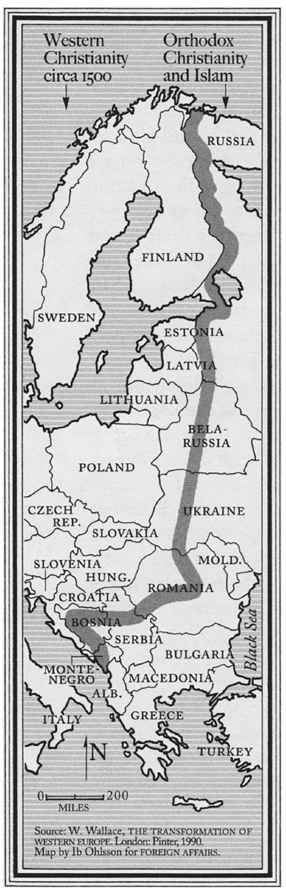

::: page_top_padding
[•]{.char-ccust4}

## []{#page_83 .pagebreak epub:type="pagebreak" role="doc-pagebreak" title="83"}第七章 {#chapter-seven .para-cn-chap-pg}

## [一个挣脱束缚的气球]{.char-ccust50} {#a-balloon-cut-loose .para-ct}

1976年12月，在华盛顿特区举行的美国历史协会会议上，阿默斯特学院中世纪欧洲史教授弗雷德里克·L·切耶特发表讲话，呼吁放弃曾经是美国高等教育本科生必经仪式的西方文明标准课程。关于这些被亲切地（也常常被不那么亲切地）称为“西方文明”的概览课程的辩论，几十年来一直在大学校园里积聚势头，尤其是在20世纪50年代和60年代战争结束后。

问题在于，这个国家的高校本科生应该学习哪些关于西方文明的知识——从古罗马和古希腊，到欧洲现代民族国家的出现，再到我们自己在美利坚这个新共和国的实验。更根本的问题是，西方文明这个概念本身是否足够连贯和充实，从而在教育背景下具有真正的意义。这些课程催生了整整一个亚文化，近半个世纪以来都在校园里辩论其作用和地位，这场辩论也预示了今天仍在显现的文化鸿沟。而它们消亡的历史，对硅谷的许多人来说已经失落，却揭示了我们当前困境的根源。问题不仅仅在于应该教给大学生什么，而在于他们教育的目的究竟是什么，除了仅仅让那些有幸进入好学校的人致富之外。我们社会的价值观是什么，除了宽容和尊重他人权利之外？高等教育在阐明一种能够作为更广泛凝聚力和共同目标基础的集体认同感方面，又扮演着什么角色（如果有的话）？那些后来创建硅谷、推动计算机革命的几代人，正是在对国家乃至西方本身价值进行大规模重新评估的时期成年的。

传统主义者认为，本科生需要对柏拉图和约翰·斯图亚特·密尔(或者是但丁和马克思)等思想家和作家有基本的了解，以便理解他们自己享有的自由以及他们所处的世界地位。当时许多人渴望从一个极其破碎的历史和文化记录中构建一个连贯的叙事，这种渴望是巨大的。西方传统核心课程的支持者有些务实地认为，美利坚共和国需要在日益多元化的文化精英中构建一种共同的传统或美国认同感。例如，1947年开始在芝加哥大学任教的历史学家威廉·麦克尼尔认为，构建一个统一的文本和叙事（如果不是神话）的经典，让学生“有一种共同的公民意识和参与理性社区的感觉，一种对人才开放的职业的信念，以及一种对真理能够代代相传、不断扩大和完善的信念。”以西方传统为中心的核心课程的优点在于，它促进了甚至使得在美国从破碎和迥异的文化经历中构建一种民族认同成为可能——这是一种公民宗教的形式，主要与几个世纪以来的真理和历史联系在一起，但其渴望为一项民族事业提供连贯性和基础，也使其具有抱负性。

包括阿默斯特学院的切耶特在内的反对者，反对他们认为是关于西方文明弧线和发展的基本虚构的宏大叙事，他们认为这样的课程过于排外和不完整，不能强加给学生。纽约大学哲学教授、整个“西方”概念的批评者夸梅·安东尼·阿皮亚后来会说，“我们伪造了一个关于雅典民主、大宪章、哥白尼革命等等的宏大叙事”，最终得出一个结论，尽管有相反的证据，即“西方文化的核心是个人主义、民主、自由、宽容、进步、理性和科学的。”对于阿皮亚和许多其他人来说，理想化的西方形式是一个故事，也许引人入胜，有时也很有说服力，但终究是一个叙事，一个被强加、笨拙地塞进和安装在历史记录上的叙事，而不是从中产生的。

当然，“西方”究竟位于何处，也就是说，哪些国家算数，也备受争议。当塞缪尔·亨廷顿在1993年的《外交事务》上发表他的文章《文明的冲突？》时，他附上了一张欧洲地图，上面有一条线，当时牛津大学的研究员威廉·华莱士认为，这条线显示了截至1500年西方基督教的推进范围。

大多数学者抵制他们所描述的亨廷顿将世界划分为七个或可能八个离散“文明”的轻率做法。但虽然他的框架确实是简化论的——事实上，它的吸引力正源于其表面的精确性——对亨廷顿的全面反抗最终排挤了关于文化在塑造从国际关系到经济发展等一切方面作用的严肃规范性讨论。文化之间的断层线在哪里？哪些文化与促进其公众利益相一致？国家在阐明或捍卫一种民族文化感方面应该扮演什么角色？整个领域对于那些有终身教职想法的学者来说都成了禁区。

{#page_86_img1 .fill}

------------------------------------------------------------------------

::: {.para-orn aria-hidden="true"}
• • •
:::

到20世纪70年代末，传统主义者已经输掉了这场战斗，如果不是整场战争的话。切耶特在华盛顿的美国历史协会会议上告诉他的同事们：“没有一个历史，而是有许多可能的历史。”切耶特绝不是一个激进分子。他1932年出生于纽约市，从宾夕法尼亚州一所成立于19世纪末的私立寄宿学校默瑟斯堡学院毕业后进入普林斯顿大学。他在哈佛大学完成博士学位，并于1963年成为阿默斯特学院的欧洲史教授，在那里他任教了近五十年。切耶特的学术兴趣倾向于保守，以及欧洲历史中较为晦涩的角落，特别是11世纪和12世纪的中世纪法国。这样一来，切耶特本人就是他试图挑战的学术体制的一员，他呼吁改革也表明了学术界内部对废除关于西方文明的必修概览课程旧制度的广泛支持——切耶特和其他人开始认为，这类历史和思想的内在连贯性不足以证明强制新生入学是合理的。他向他的学术同行阐述了当时对这类课程的主要批评，他将其描述为“意识到过去被认为是普遍的东西本身就是宗派的。”

这种退却已经持续多年。在美国，对西方文明课程主导地位的首次认真挑战是在华盛顿会议召开十年前，在20世纪60年代的动荡之后，许多人开始质疑谁的历史正在被讲述和教授。在某些情况下，正如一位观察家所说，这些课程“自然消亡，而在另一些情况下则被直接谋杀。”例如，在斯坦福大学，西方文明史在二战结束后多年来一直是必修课，向学生介绍了一系列精心挑选的作品，从柏拉图和卢梭到马克思和阿伦特。但在1968年11月，一个由十人组成的委员会决定放弃这一要求。该小组主要由学术管理人员和教授组成，但也包括一名本科哲学专业的学生，这或许是对当时民主精神的一种致敬。该小组在其报告中得出结论，这类模仿哥伦比亚大学和芝加哥大学类似项目的课程“已经死亡或正在消亡”。世界，包括美国，在二战结束后已经被重塑。就在斯坦福大学决定取消其标志性的概览课程的几个月前，马丁·路德·金和罗伯特·F·肯尼迪被暗杀。在前一个冬天，北越军队对南越发动了春节攻势，许多人认为这将是美国卷入战争的终结的开始。这十年的动荡与学术界渴望抓住许多人认为是过去遗迹（一个可能从未存在过的过去）之间的不协调已经变得难以承受。

斯坦福大学的这门课程于次年，即1969年结束，根据当时该校学生报纸的一篇文章，是“一声呜咽而非一声巨响”地结束了。校园里对废除必修经典旧制度的抵制，在最后是微弱的，如果不是完全无力的话。正如一位历史学家指出的，到20世纪60年代末，一旦对教育要求的挑战获得势头，学生们“遇到的教师已经准备好退却了。”对许多批评者来说，为一门像西方文明史这样雄心勃勃的课程制定教学大纲的编辑过程的明显随意性——以及从如此庞大的候选名单中只选择少数几部作品——本身就是放弃这个项目的理由。“我们有柏拉图，但为什么没有亚里士多德？”加州大学伯克利分校哲学系主任约瑟夫·图斯曼在1968年发表的一篇文章中问道。“为什么不多来点欧里庇得斯？《失乐园》，但为什么不是但丁？约翰·斯图亚特·密尔，但为什么不是马克思？”

然而，这样的编辑争议掩盖了经典之争所暴露的更为根本的问题，以及所涉利害的重要性。这门概览课程之所以能蓬勃发展几十年，其前提是美国学术界及其学生需要在更广阔的历史背景下扎根，将美国的政治和文化发展与欧洲和古代的先例联系起来。正如19世纪90年代美国历史协会组建的一个教师审查委员会的成员所指出的，“美国历史就像在空中——一个在半空中航行的气球——除非它被锚定在欧洲历史上。”然而，这个气球现在被切断了绳索。

------------------------------------------------------------------------

::: {.para-orn aria-hidden="true"}
• • •
:::

我们是怎么走到这一步的？当前“西方”的概念，即一套植根于古代并贯穿历史延伸至现代的文化和政治价值观，始于19世纪末。它的含义会随着时间的推移而变化和演变，但最终正确地围绕着一套共享的实践或传统而凝聚起来，这些实践或传统使得大规模的集体存在成为可能，甚至是可忍受的。正如温斯顿·丘吉尔1938年在英格兰西海岸布里斯托尔大学的一次演讲中所观察到的，文明“意味着一个基于平民意见的社会”，“暴力、武士和专制首领的统治、营地和战争的条件、骚乱和暴政，都让位于制定法律的议会和长期维持这些法律的独立法院。”对丘吉尔来说，文明的兴起使得公众能够过上“更广阔、更少烦扰的生活”。

许多人认为，整个概念都应该被抛弃——“西方”这个不完美且不断变化的描述性力量（如果有的话）被其与帝国主义的统治、优越感和对帝国边缘殖民地臣民的征服理论的历史联系所压倒。例如，阿皮亚主张放弃“西方文明的观念”，对他来说，这“充其量是大量混乱的根源”，而“最坏的情况是，它阻碍了我们应对我们时代一些重大的政治挑战。”对阿皮亚和许多其他人来说，西方成了一个道德蔑视的对象，阻碍了我们对历史的理解，给解释的任务加上了一个繁琐的叙事架构，它所掩盖的比它所启发的要多。他们认为，这座大厦必须被推倒。

对一个单一的、完全连贯的西方文明概念的解构和挑战始于20世纪60年代，但可以说在1978年爱德华·萨义德的《东方主义》出版时达到顶峰。《伦敦书评》的美国编辑亚当·沙茨在2019年的一篇文章中，即《东方主义》首次出版四十年后，认为这本书是“战后时代最具影响力的思想史著作之一”。一群多年来一直在发展的批评意见无缝地围绕着萨义德的论著凝聚起来，这本书也成了重塑学术界的工具。

确实，很难夸大萨义德创作的力量和纯粹的文化影响力。“东方主义者”这个词本身在某个崛起的文化精英阶层中成了一种蔑称——一种能够让讨论戛然而止的武器，一个具有讽刺意味的词，它本身也成了在大学校园里构建身份和行使权力的一种手段。正如沙茨所说，“东方主义”这个词，在萨义德普及它近半个世纪后，“已经成为那些在自由派校园里让对话停止的词语之一，在那里，没有人愿意被指责为‘东方主义者’，就像他们不想被称为种族主义者、性别歧视者、恐同者或跨性别恐惧者一样。”然而，这本书的遗产更为复杂。一种植根于殖民主义观点的教条主义，很快就被其他教条主义所取代，这些教条主义通常同样蔑视那些违背了新的公认智慧的竞争性历史和文学观念。就像19世纪及以前的东方主义者将某些文化和民族划定为几乎没有贡献、不如文明特权核心平等的群体一样，20世纪80年代和90年代的学术体制在萨义德之后也找到了自己的方法，来识别甚至“他者化”某些论点，认为它们不值得进行批判性参与。

这本书也重塑了美国乃至全世界人文学科的机制和内部政治。作家潘卡伊·米什拉写道，《东方主义》“开启了上千个学术生涯。”确实，这本书在美国高等教育中催生了一个新产业，这个产业建立在瓦解对世界的殖民主义理解之上，同时，米什拉认为，它也为一部分“知识分子移民，主要是男性”提供了一种自我推销的手段，他们“通常是各自国家统治阶级的成员——甚至是那些在殖民统治时期蓬勃发展的阶级的成员。”正如米什拉所说，“对于一个更上流的东方臣民来说，谴责东方主义的西方已经成为在其中找到终身教职的一种方式。”

《东方主义》对文化的影响是如此彻底和全面，如此总体化，以至于今天许多人，尤其是在硅谷，几乎没有意识到它在塑造和构建当代话语以及他们自己对世界的看法方面的作用。蒂莫西·布伦南在其萨义德传记《思想之地》中写道，从20世纪90年代末开始，“后殖民研究不再仅仅是一个学术领域”，而是一个完整的世界观，拥有一套高度专业化的术语，包括“‘他者’、‘杂糅’、‘差异’、‘欧洲中心主义’”——这些术语“现在可以在戏剧节目单和出版商名单、博物馆目录，甚至好莱坞电影中找到。”确实，美国一大批知识分子，以及许多与学术界相邻的人，包括作家和记者，都将自己的政治——一种在20世纪90年代及本世纪成为美国精英体制思想主流形式的政治，包括在硅谷——围绕着一本许多人从未直接接触过，有些人甚至不知道其存在的书来定位。

《东方主义》的实质性胜利在于，它向广大读者揭示了历史的讲述，即从零散的细节和事实中进行总结和综合成叙事的行为，本身并非一种中立、无私的行为，而是在世界上行使权力的一种方式。正如萨义德本人在1994年为该书写的后记中所解释的那样，“身份的构建与每个社会中权力和无权力的分配息息相关，因此绝非仅仅是学术上的空谈。”这样一来，历史和人类学产生的引擎和机制就成了萨义德研究的对象。而正是那个引擎倾向于划分，倾向于定义“我们”和“他者”，对萨义德来说，这本身就是观察行为的结果，或许也是其必要组成部分。正如萨义德引述英国历史学家丹尼斯·海伊所明确指出的那样，“欧洲的观念”是“一个集体概念，将‘我们’欧洲人与所有‘那些’非欧洲人区分开来。”近半个世纪后，这一观察似乎无可非议，甚至近乎平庸。但在20世纪70年代，这绝对是激进的，动摇了整个大学体制的学术存在模式。他的核心论点为今天人文学科中许多被认为是基础性的东西提供了基础，即说话者的身份与他或她所说的话同等重要，甚至更重要。我们对说话者与所说之物、讲故事者与故事、最终身份与真理之间关系的理解的这种重新定位，其后果是深远而持久的。但同时，在其更极端的表述中，也是有害的。正是对他主要主张的过度延伸，引发并赋权了一场解构主义运动，这场运动在接下来的几十年里，成功地将说话者的身份的重要性提升到所说内容之上。

批评者众多，来自各个角度。其一，萨义德似乎对记录东方世界内部用来为征服各种下层阶级辩护的类似“权力-知识”体系不那么感兴趣。正如米什拉所观察到的，“这本书没有表现出对它之前的亚洲、非洲和拉丁美洲思想的庞大档案的任何认识，包括非西方精英设计的论述——例如印度的婆罗门种姓理论——以使其统治看起来自然而合法。”

其他人则试图更直接地攻击他们认为是萨义德核心论点的东西。例如，芝加哥大学的威廉·麦克尼尔，他是20世纪60年代逐渐被淘汰然后更迅速地被淘汰的西方文明课程要求的捍卫者，他有胆量抵制他所描述的在20世纪下半叶盛行的道德相对主义的兴起，他和其他批评者声称，这种相对主义常常以更悦耳的多元文化主义的幌子出现。麦克尼尔在1997年发表的一篇文章中写道，构建世界历史课程的尝试本身“常常被”他认为是“公然错误的关于所有文化传统平等的断言所污染”。他并非直接回应萨义德，但萨义德及其论点在当时无处不在，以至于到那时任何涉足此类辩论的人都必然在与他对话。

这也提醒我们文化变迁的速度有多快，因为像麦克尼尔这样的主张今天几乎肯定会招致封杀。敢于对文化做出规范性主张，包括对特定文化的具体优劣做出评价的历史学家，到20世纪末基本上已经绝迹，或者至少失业了。即使是温和地指出过去五个世纪左右欧洲与其前帝国在经济产出和军事实力上的差异的尝试，也被推到了文化对话的边缘。正如历史学家尼尔·弗格森所观察到的，从16世纪开始崛起的西方主要帝国，到20世纪10年代，已经控制了全球经济产出的74%。

![[]{#page_94 .pagebreak epub:type="pagebreak" role="doc-pagebreak"
title="94"}图8 ¶ 西方帝国：领土和全球经济产出份额](../images/007_Karp_9780593798690_all_art_r4.jpg){#page_94_img1
.fill}

仅仅背诵这样一个事实，就已经变得具有挑衅性，这表明我们当前的文化对真理存在根本性的不安，以及或许它已经丧失了将描述性主张与规范性主张分离开来的能力。从经验上指出，某个国家子集已经主导了全球事务，这并不等同于规范性地主张这样的结果是正当的。然而，在西方，许多观察家已经对调查这种超常表现的原因和理由失去了兴趣。我们被教导要干脆转过身去，换个话题。承认美国及其盟友压倒性优势的描述性主张，同时暂停（哪怕是暂时地）对这种权力分配的道德含义的讨论，这种能力可以说是记者和民意研究员内特·西尔弗所称的“脱钩”的一种形式。这种在搁置对陈述的含义或对“说话者身份”的看法的同时评估陈述真实性的能力，在太多人中间已经萎缩了。一个人应该能够在不知道是谁提出一个描述性主张的情况下判断其是否真实。

尊重自己的知识对手，即使是勉强的，也可能是一个巨大的优势，尤其是在一个已经习惯于贬低对手而不是与之交锋的文化中。在政治领域，当然还有商业领域，太多的参与者无法与他们的对手保持情感距离，无法以最佳竞争者带到赛场上的那种清晰和近乎宽宏大量的态度来对待他们。最有效率的头脑往往是那些深刻理解其对手的优势和技能，并拒绝进行愤怒和道德义愤的宗教战争的人。自以为是的迷雾往往对良好的判断力是致命的。正如万尼瓦尔·布什在1949年所写，纳粹未能开发出足够有效的近炸引信，这种引信能让炸弹在击中目标前引爆，是他们傲慢的结果，而不是他们无能。他写道，德国人难以置信，“该死的美国佬”竟然在他们失败的地方取得了成功。

------------------------------------------------------------------------

::: {.para-orn aria-hidden="true"}
• • •
:::

20世纪下半叶对西方的系统性挑战，对其历史和身份，以及对美国计划的挑战，无论它是什么或应该是什么，如果有什么的话，都在其身后留下了一个真空。一个知识体系或许被正确地推翻了。但没有建立任何东西来取而代之。20世纪60年代及以后在大学校园里被称为“经典之争”的战争，以及随之而来的学术界对西方本身的挑战，代表的不仅仅是对美国身份内容的斗争，而是对是否应该有任何内容的斗争。

对美国社区归属感的淡薄观念，包括尊重他人权利和对自由贸易和市场力量的新自由主义经济政策的广泛承诺。而对归属感的更浓厚观念，则需要一个关于美国计划过去、现在和未来的故事——一个关于参与这个建设共和国的狂野而丰富的实验意味着什么的故事。在这个国家和许多其他国家，民族社区的成员资格正面临着被简化为某种狭隘和不完整的东西的风险，例如，来自共享语言或流行文化（从娱乐到体育到时尚）的松散归属感。许多人主张这种退却。到20世纪70年代末，整整一代人对更广泛的民族认同或共同事业持怀疑态度。而那一代人，包括许多后来创建硅谷并推动计算机革命的人，将注意力转向了别处，转向了个人消费者，对推进一个其整个计划和存在理由都受到如此彻底质疑的政府的错误冒险不感兴趣。
:::

::: {#d1-d2s9d3s4_footnotes .footnotes .footnotes epub:type="footnotes"}
[跳过注释](Karp_9780593798706_epub3_c008_r1.xhtml)

::: {#_footnote_d1-00015ea9 .footnote .footnote epub:type="footnote" role="doc-footnote"}
[[\*1](Karp_9780593798706_epub3_c007_r1.xhtml#_footnote_referrer_d1-00015ea9 "footnote reference"){.footnote
role="doc-backlink"}
]{.footnoteNum}[]{#Y_d1-EndnotePhraseInText218}亨廷顿计算的“主要文明”包括“西方、儒家、日本、伊斯兰、印度、斯拉夫-东正教、拉丁美洲和可能的非洲文明”。
:::

::: {#_footnote_d1-00015eac .footnote .footnote epub:type="footnote" role="doc-footnote"}
[[\*2](Karp_9780593798706_epub3_c007_r1.xhtml#_footnote_referrer_d1-00015eac "footnote reference"){.footnote
role="doc-backlink"}
]{.footnoteNum}[]{#Y_d1-EndnotePhraseInText232}例如，法国人类学家克劳德·列维-斯特劳斯哀叹他所描述的西方文明发展给作为他兴趣对象的土著社会带来的“巨大而不可理解的灾难”——对他来说，那是“人类无辜的一部分”。
:::

::: {#_footnote_d1-00015eaf .footnote .footnote epub:type="footnote" role="doc-footnote"}
[[\*3](Karp_9780593798706_epub3_c007_r1.xhtml#_footnote_referrer_d1-00015eaf "footnote reference"){.footnote
role="doc-backlink"} ]{.footnoteNum}[]{#Y_d1-EndnotePhraseInText241}有些人对萨义德的解读过于宽泛，在延伸他核心的、 brilhante 的思想时过于激进。例如，萨义德经常被误解为声称对东方的实际知识是不可能的。从这个意义上说，他不是后现代主义者。有事实可寻；只是需要揭露那些负责寻找事实的人的动机和意识形态，才能有希望评估他们的工作。
:::
:::
