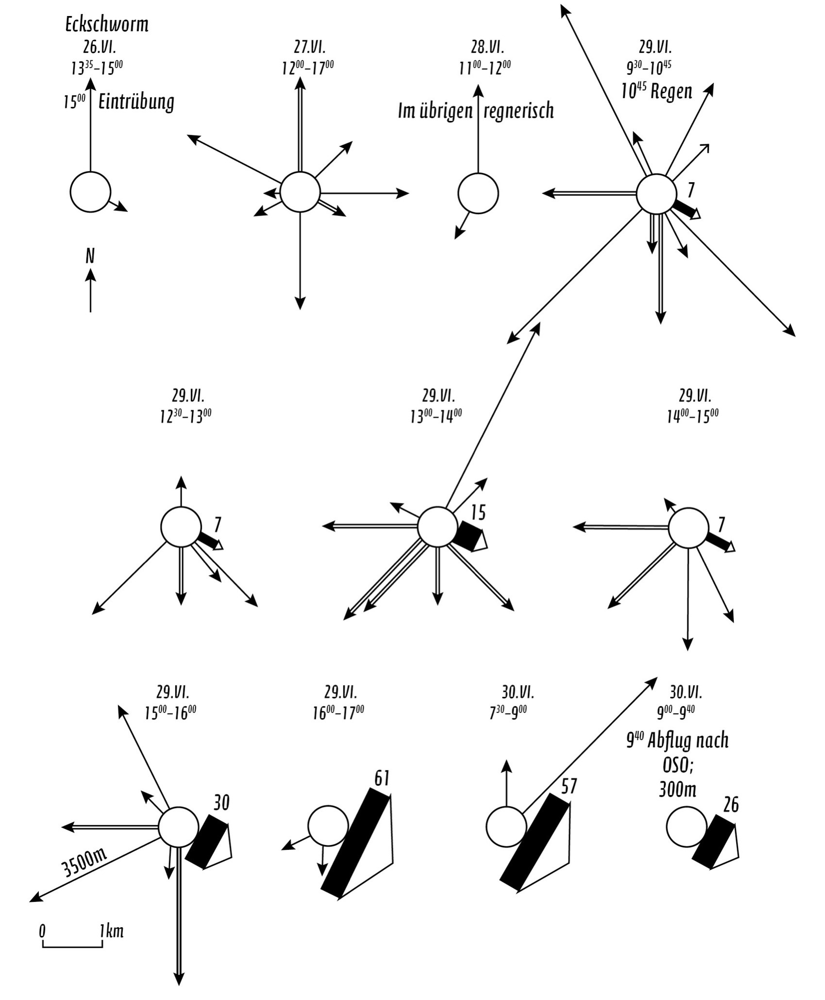

::: page_top_padding
[•]{.char-ccust4}

## []{#page_115 .pagebreak epub:type="pagebreak" role="doc-pagebreak" title="115"}第十章 {#chapter-ten .para-cn-chap-pg}

## [埃克蜂群]{.char-ccust50} {#the-eck-swarm .para-ct}

[]{#Y_d1-EndnotePhraseInText282}

1951年6月26日，下午1点30分左右，在德国慕尼黑的一个公园里，一群蜜蜂开始聚集。这小群蜜蜂最终将帮助我们重塑对动物心智及其无指导合作能力的理解。慕尼黑大学动物研究所的研究员马丁·林道尔在那个夏日的午后，正在记录这群蜜蜂，作为研究蜂巢行为以及蜜蜂在成百上千甚至成千上万个体之间协调能力的一部分。他被蜜蜂（*Apis mellifera*）的行为所吸引，并决心揭示单个蜂群中个体之间责任的委派，特别是当它们开始寻找和决定新的潜在筑巢地点时。

[]{#Y_d1-EndnotePhraseInText283}林道尔于1918年出生于巴伐利亚南部。他的父亲也是一个养蜂人，是一个农民，家里有十五个孩子。随着希特勒上台，战争席卷欧洲大陆，林道尔最终在德国军队服役了三年。然而，他的兴趣在别处，1942年在俄国前线受伤后，他退伍了。[]{#Y_d1-EndnotePhraseInText284}康奈尔大学的生物学教授托马斯·D·西利曾广泛撰写关于林道尔工作的文章，他指出，林道尔曾将他服役后回归的科学界描述为“一个全新的人类世界”。探索自然世界对林道尔来说是一种慰藉，战后他退隐于科学之中。

他属于那一代动物学家，他们的工作早于遗传学研究在该领域的兴起和最终的主导地位。在十九世纪和二十世纪的一段时间里，像林道尔这样的生物学家了解动物心智的最佳途径是通过其外在行为；对基因的力量和内部运作的更全面的理解，作为了解物种本质的一种手段，仍然遥不可及。这些早期的自然世界科学家，包括法国心理学家阿尔弗雷德·比奈，都是该领域的观察者，而且是敏锐的观察者。他们所研究的动物和人类行为背后的奥秘，对大多数人来说是看不见的，但对于任何能够仔细观察并持续足够长时间的人来说，这些奥秘都唾手可得。

[]{#Y_d1-EndnotePhraseInText285}当动物寻找新家时，无论是鹅、切叶蚁、马还是麻雀，它们通常会单独冒险，有时成对，寻找合适的住所。然而，欧洲蜜蜂的做法与常规大相径庭。[]{#Y_d1-EndnotePhraseInText286}大多数动物独立探索环境，而蜜蜂则是“一个由2万到3万个体组成的大型群体*一起*搬入新的巢穴”，林道尔写道——这个过程需要巨大的协调，但没有中央蜂王或其他专门的领导者来指导群体的工作。成千上万的个体生物如何组织起来，勘察潜在的筑巢地点，最终在众多选择中选定一个，然后一起搬到新家，这个过程对林道尔和他的同代人来说绝对是一个谜。

1951年的这个夏日午后，林道尔一直在观察的这群蜜蜂起初很小。它们开始聚集在一个雄伟的海王星石像附近，海王星手持三叉戟，从附近喷泉的水中升起。[]{#Y_d1-EndnotePhraseInText287}慕尼黑大学动物研究所曾授予林道尔研究该研究所维护的蜂群的许可，该研究所位于一个公园内，该公园曾是19世纪初建造的植物园的所在地，附近树木和枝叶中有许多僻静而有吸引力的潜在筑巢地点。[]{#Y_d1-EndnotePhraseInText288}那天下午三点左右，公园上空开始形成云层，林道尔注意到蜜蜂撤退到附近的一个灌木丛中，在那里过夜。第二天，云层散去，太阳重现，蜜蜂们又开始寻找筑巢的地方。

这样的搜索是复杂的事务。它们包括几十甚至几百只侦察蜂在附近勘察潜在的选择。[]{#Y_d1-EndnotePhraseInText289}蜜蜂返回蜂群，表演一种后来被称为“舞蹈语言”或*Tanzsprache*的舞蹈，这是奥地利出生的动物学家、林道尔的同事卡尔·冯·弗里施描述的，他后来因对该主题的研究而获得诺贝尔奖。这是一种蜜蜂的交流方式，它们在聚集观看的蜜蜂面前来回摇摆身体。弗里isch和林道尔发现，这种舞蹈的距离，也就是说，侦察蜂是走一两厘米，与它们返回的潜在筑巢地点的距离成正比，因此表明了飞到那里需要多远。此外，越来越多的证据表明，相对于太阳的位置，步行的角度表明了新巢穴的方向。[]{#Y_d1-EndnotePhraseInText290}在下午的过程中，侦察蜂返回主蜂群，报告了该地区的八个潜在筑巢地点，包括附近窗户顶部模具上的一个裂缝、一个啄木鸟洞和树上的一个小空洞。[]{#Y_d1-EndnotePhraseInText291}弗里isch和林道尔已经清楚地看到，个别侦察蜂会为不同的地点跳舞，而为不同地点跳舞的侦察蜂数量将使蜂巢能够就最佳选择进行投票。

对林道尔来说，蜜蜂代表了自然界中不同的东西。[]{#page_118 .pagebreak epub:type="pagebreak" role="doc-pagebreak" title="118"}他观察到的蜂群不仅仅是离散的个体动物的集合。它们协调的精确性和广度，以及缺乏任何明显的集中管理手段，清楚地表明蜜蜂形成了一个离散的系统，一个连贯的整体，[]{#page_119 .pagebreak epub:type="pagebreak" role="doc-pagebreak" title="119"}其评估和适应环境的能力将在未来几十年促使人们重新评估什么构成一个有机体。[]{#Y_d1-EndnotePhraseInText292}林道尔以一种细腻而崇敬的口吻叙述了这一场景，他指出，虽然八个地点中的两个“已经获得了一些人气”，但“自然还没有达成任何协议”。[]{#Y_d1-EndnotePhraseInText293}第二天，他注意到侦察蜂似乎对北边的地点不那么热情了，大概是因为一夜之间发生了什么事，也许是一场暴雨使巢穴无法使用。

{#page_118_img1 .fill}

蜂群迅速做出了相应的调整。[]{#Y_d1-EndnotePhraseInText294}侦察兵们找到了一批新的潜在地点，林道尔写道，其中一些“只通过一次舞蹈宣布，没有引起广大民众的注意”，而“另一些则受到了更多的关注”。[]{#Y_d1-EndnotePhraseInText295}在接下来的几个小时里，蜜蜂们继续为它们偏爱的筑巢地点跳舞——一片紧张和移动的模糊景象，成千上万的个体通过这种方式进行谈判，并最终投票选出它们新家的最佳候选地。林道尔报告说，一个三百米外的特定地点最终“成为最受欢迎的地点”。剩下的坚持者已经让步并屈服了。第二天早上9点40分，林道尔观察到，整个蜂群在就各种选择进行谈判并确定了一个首选地点后，“起飞并搬进了新家”。

埃克蜂群的观察，正如它后来为人所知的那样，代表了我们理解蜜蜂行为及其交流能力的一个关键时刻。[\[\*\]](Karp_9780593798706_epub3_c010_r1.xhtml#_footnote_d1-00015ec0 "footnote"){#_footnote_referrer_d1-00015ec0 .char-fnref .footnote_ref .noteref epub:type="noteref" role="doc-noteref"} 但林道尔的工作也揭示了一些更根本的东西，即群体，甚至是极其庞大的个体动物群体，有潜力围绕[]{#page_120 .pagebreak epub:type="pagebreak" role="doc-pagebreak" title="120"}一个特定的问题组织起来并对不断变化的条件做出反应。[]{#Y_d1-EndnotePhraseInText297}正如一组研究人员在撰写关于蜜蜂和其他动物的集体决策对人类组织（包括医疗保健领域的护士和医生）的影响时指出的那样，蜜蜂的社会结构展示了“无需中央控制即可出现的协调行为”。

创业公司，在其理想形式下，应该成为一个蜜蜂群。这种协调和运动，没有一个专横和不必要的集中控制机制，在许多方面是美国背景下成功的创业和工程文化的最基本特征。林道尔和其他人后来研究的蜜蜂，并没有采用基于种姓的社会等级制度来应对它们面临的巨大的集体行动挑战，而是尽可能大地将自主权分配给组织的边缘——侦察兵。处于群体边缘的个体，通常拥有关于潜在筑巢地点适宜性的最新和最有价值的信息，并且能够考虑到不断变化的条件，他们是通过为群体跳舞来投票的人。蜂群*围绕*手头的问题*自我组织*。

其他物种也表现出类似的行为模式。意大利物理学家乔治·帕里西多年来一直在研究椋鸟，希望了解它们如此迅速地相互传递信息的方式，从而能够以似乎作为一个整体移动的鸟群漩涡飞行。2005年12月，他和他的团队在罗马市中心的马西莫宫顶部安装了三台摄像机，该建筑是国家罗马博物馆的所在地。[]{#Y_d1-EndnotePhraseInText298}每台摄像机都设置为拍摄例行在广场上空盘旋和旋转的椋鸟群，每秒总共拍摄十张图像。[]{#Y_d1-EndnotePhraseInText299}他发现，鸟群，对于普通观察者来说，通常被认为是球体或形状奇特的球体，实际上更像圆盘。凭借他每秒十张的图像，以及鸟类在空间中移动的三维重建，帕里西的团队能够绘制出给定鸟群中每只鸟的精确位置。

与蜜蜂的情况一样，椋鸟群体的运动通常由鸟群边缘的鸟发起，那些对潜在捕食者和外部世界有最佳视角的鸟——而不是由预先注定的领导者或首领发起。关于群体将向哪个方向移动的指导，然后从一只鸟传递到另一只鸟，从鸟群的边缘到其核心，在不到一秒钟的时间内，并在数百个个体的整个群体中无缝共享。[]{#Y_d1-EndnotePhraseInText300}正如帕里西所写，关于鸟群中向哪个方向飞行的信息在它们之间共享，“就好像通过令人难以置信的快速口耳相传一样”。

------------------------------------------------------------------------

::: {.para-orn aria-hidden="true"}
• • •
:::

在大多数人类组织中，从政府官僚机构到大公司，个人大量的精力和才能都用于争权夺利、邀功诿过。参与一项事业的人们宝贵而稀缺的创造力，往往被错误地用于构建自私自利的等级制度和监视谁向谁汇报。然而，在蜜蜂中，侦察兵返回蜂巢后捕获的信息没有经过调解。椋鸟在向邻居发出鸟群转向的信号之前，也不必征求上级的许可。没有每周向中层管理人员提交的报告，也没有向更高级别的领导者做的演示。没有为其他会议做准备的会议或电话会议。蜂群和椋鸟群并非由层层叠叠的副总裁和副总裁助理组成，他们指导着各个小组的工作，并管理着上级的看法。只有鸟群或蜂群。正是在那些运动的漩涡中，某种即兴创作和松散得以形成。
:::

::: {#d1-d2s10d3s2_footnotes .footnotes .footnotes epub:type="footnotes"}
[Skip Notes](Karp_9780593798706_epub3_c011_r1.xhtml)

::: {#_footnote_d1-00015ec0 .footnote .footnote epub:type="footnote" role="doc-footnote"}
[[\*](Karp_9780593798706_epub3_c010_r1.xhtml#_footnote_referrer_d1-00015ec0 "footnote reference"){.footnote
role="doc-backlink"} ]{.footnoteNum}[]{#Y_d1-EndnotePhraseInText296}在许多情况下，观察中的蜂群的名称来自它们在慕尼黑的位置（例如，“栅栏”、“榆树”和“树篱”蜂群）。德语单词*Eck*在英语中意为“角落”。
:::
:::
