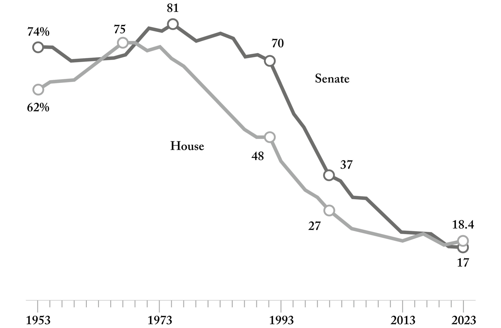

::: page_top_padding
[•]{.char-ccust4}

## []{#page_139 .pagebreak epub:type="pagebreak" role="doc-pagebreak" title="139"}第十三章 {#chapter-thirteen .para-cn-chap-pg}

## [制造更好的步枪]{.char-ccust50} {#building-a-better-rifle .para-ct}

[]{#Y_d1-EndnotePhraseInText345}

2011年9月28日，一支由24名美国士兵组成的小队正在阿富汗南部的赫尔曼德省巡逻，支援特种部队人员与该地区村庄领袖建立关系。
[]{#Y_d1-EndnotePhraseInText346}这片位于中亚的土地，在过去三千年的历史长河中，一直处于多个帝国的危险交汇点，自公元前四世纪的亚历山大大帝以来，就经历了反复的入侵循环。亚历山大大帝本人在一次从东部的开伯尔山口到西部的波斯的战役中，被一名阿富汗弓箭手用箭伏击射中。那个九月的下午，巡逻队停了下来，两名海军陆战队员下车查看周围情况，很可能是在寻找阿富汗叛乱分子可能在他们路线上隐藏的路边炸弹的迹象。片刻之后，一枚炸弹引爆，两名海军陆战队员身受重伤，倒在地上。
[]{#Y_d1-EndnotePhraseInText347}来自印第安纳州波特的21岁陆军军医詹姆斯·巴茨立即冲上前去帮忙——甚至没有花时间去拿自己的头盔和步枪。
[]{#Y_d1-EndnotePhraseInText348}随后发生了第二次爆炸。“两名士兵倒下了，”他的父亲后来回忆道。
“[]{#Y_d1-EndnotePhraseInText349}吉米没有犹豫。”巴茨和他跑去帮助的两名海军陆战队员，三个人都在那天牺牲了。

路边炸弹，后来被称为简易爆炸装置（IED），在阿富汗被广泛用于对付美国和盟军。
[]{#page_140 .pagebreak epub:type="pagebreak" role="doc-pagebreak" title="140"}在接下来的几个月里，其使用显著扩大。
[]{#Y_d1-EndnotePhraseInText350}到2012年，已有超过三千名美国军人被这些埋藏在路下的手工炸弹炸死，而叛乱分子则在远处等待引爆。
[]{#Y_d1-EndnotePhraseInText351}仅在2012年，全国就发生了14500起针对美国和盟军士兵的IED袭击。这些炸弹的炸药材料通常由随处可见的农作物化肥制成，给美军带来了日益严重的危机。美军被派往阿富汗，是为了与遍布该地区的村镇中的地方民兵建立有意义的关系和联盟——这项工作需要不断的旅行和与平民的互动。
[]{#Y_d1-EndnotePhraseInText352}正如一位花了数年时间搜寻和拆除这些炸弹的美国海军军官后来观察到的那样，IED迫使美国士兵“将自己限制在巨大的装甲车内，高速行驶或干脆犁过农民的田地以避开道路。”

[]{#Y_d1-EndnotePhraseInText353}从2006年到2012年，美国军方花费了超过250亿美元，试图开发解决方案来对抗和防御这些通常制造成本不到300美元的简陋爆炸装置。运送部队穿越阿富汗的装甲运兵车尤其脆弱；它们的防护装甲太轻，无法承受隐藏在各处的路边炸弹的爆炸威力。
[]{#Y_d1-EndnotePhraseInText354}美国陆军决定订购一批新车，采用更坚固、更具防护性的陶瓷复合材料作为装甲。
[]{#Y_d1-EndnotePhraseInText355}到2012年10月，将有超过24000辆此类车辆被制造出来并送往阿富汗和伊拉克的战场。然而，作为回应，叛乱分子开始制造更大的炸弹，以及可以在更远、因此更安全的距离遥控引爆的炸弹。
[]{#Y_d1-EndnotePhraseInText356}这些威力更强大的爆炸装置被战场上的士兵称为“水牛杀手”，因为它们甚至能够摧毁军方为应对威胁而订购的更大、装甲更厚的车辆。

[]{#page_141 .pagebreak epub:type="pagebreak" role="doc-pagebreak" title="141"}到2011年，美国军方几乎所有人都清楚地认识到，需要更好的情报来评估全国特定道路和潜在路线的安全性，以及识别和抓捕炸弹制造者。
[]{#Y_d1-EndnotePhraseInText357}许多在战场上的士兵和情报官员的沮丧之处在于，他们拥有所需的信息——先前袭击的记录和地点、使用的炸弹制造材料类型、被俘叛乱分子的指纹扫描和手机号码，以及美国情报机构招募的机密线人的报告，这只是可用数据集中的一小部分。这些信息就存放在几十个甚至几百个政府系统中，任何有适当权限的人都可以访问。然而，将所有这些信息拼接成有用的东西——巡逻队在计划下一次访问邻近村庄的路线时可以使用的可操作信息，或者决定审问哪些囚犯以及他们可能提供什么信息——的任务，实际上往往是不可能完成的。

结构性问题在于，当时设计陆军软件系统的人，包括马里兰州贝塞斯达的洛克希德·马丁公司的程序员，与软件的实际用户——战场上的士兵和情报分析员——相距太远，联系太少。用户和开发者之间的鸿沟已经变得太大，无法维持任何富有成效的快速迭代和开发周期。任何技术的构建，包括军事软件系统，都需要建设者和用户之间的亲密关系——一种情感上和身体上的接近，而对于华盛顿特区郊外弗吉尼亚州和马里兰州的许多政府承包商来说，这种关系就像美国军队在世界另一端与之作战的阿富汗叛乱分子一样陌生。
[]{#Y_d1-EndnotePhraseInText358}在另一个时代，第二次世界大战期间的美国战斗机飞行员会经常访问位于纽约长岛贝斯佩奇的诺斯罗普·格鲁曼公司的前身格鲁曼公司的工厂，为公司飞机的设计和制造提供建议，包括F6F地狱猫战斗机，
[]{#page_142 .pagebreak epub:type="pagebreak" role="doc-pagebreak" title="142"}事实证明，它在太平洋空战中起到了决定性作用，据作家亚瑟·L·赫尔曼说。然而，半个多世纪后的阿富汗，士兵和供应商之间的这种联系即使没有完全断绝，也已经萎缩了。

随着陆军试图为阿富汗士兵建立一个软件系统，对错综复杂的承包商和分包商的依赖——以及一个长达数年的采购过程，其中软件建设的准备和规划往往多于实际编码——剥夺了洛克希德·马丁公司将用户反馈纳入其系统开发计划的任何真正机会。军方的软件项目已经沦为对软件*应该*是什么样子的几乎抽象概念的追求，而对实际功能和能力、工作流程和界面的关注则少得多，而这些正是决定软件对于一个在坎大哈通宵在笔记本电脑上为第二天早上的特种部队行动做准备的人是否有价值的关键。

[]{#Y_d1-EndnotePhraseInText359}2011年11月，一名在阿富汗的第82空降师情报官向美国陆军一个相对较新的部门——快速装备部队提交了一份请求。该部队位于华盛顿特区外的弗吉尼亚州贝尔沃堡，成立于2002年，是近几十年来为加快为前线士兵开发新武器、装备和软件平台的数十次尝试之一。该组织宣称的目标是在三到六个月内获得或制造出士兵需要的东西——在国防承包领域，这是一个极其雄心勃勃的时间表，因为新武器系统常常在开发中 languish 数年甚至数十年。这位情报官向弗吉尼亚州的陆军采购办公室提交了一份正式请求，要求获得 Palantir 软件的使用权，以帮助收集和分析来自阿富汗战场的情报，从而应对日益增长的简易爆炸装置威胁。赌注很高，而且还在不断增加。
[]{#Y_d1-EndnotePhraseInText360}这位军官写道，无法使用 Palantir 的软件
[]{#page_143 .pagebreak epub:type="pagebreak" role="doc-pagebreak" title="143"}导致“错失了作战机会，并给部队带来了不必要的风险”。

到2012年初，来自阿富汗战场士兵要求使用Palantir的请求开始增多，一些人想方设法绕过传统采购渠道的层层官僚机构，转而直接向高级军官发送他们对笔记本电脑和软件的请求。
[]{#Y_d1-EndnotePhraseInText361}例如，2012年1月，一名在阿富汗的情报官向陆军采购人员发送了一封电子邮件，认为陆军的数据分析系统“没有让我们的工作变得更容易，而Palantir正在给我们带来情报优势。”接下来的一个月，即2012年2月25日，同一名军官重申了他对Palantir的请求，强调了在没有有效软件的情况下发动战争的风险越来越大，以及战场士兵日益增长的挫败感。
“[]{#Y_d1-EndnotePhraseInText362}我们不会坐在这里，在我们正处于激烈战斗并遭受伤亡的情况下，还在为一个无效的情报系统而挣扎，”这位情报分析员写道。
[]{#Y_d1-EndnotePhraseInText363}据《财富》杂志的一篇文章报道，后来成为美国国防部长的詹姆斯·马蒂斯的一位副手在国防部内部一份要求使用我们软件的请求中写道：“海军陆战队员今天还活着，是因为这个系统的能力。”

对于许多远离战场的人来说，派遣士兵到世界另一端去打仗，却在这些士兵告诉你他们需要更好的装备来保命时犹豫不决，这种想法是荒谬的。更根本的问题是，随着岁月和伤亡的增加，公众对美国卷入阿富汗的普遍幻灭感开始影响和扭曲关于士兵需要什么资源来完成工作的讨论。然而，作为一个国家，我们应该能够在继续就海外军事行动的适当性进行辩论的同时，坚定不移地致力于我们要求那些挺身而出的人。如果一名美国海军陆战队员要求一把更好的步枪，我们应该制造它。软件也是如此。

[]{#page_144 .pagebreak epub:type="pagebreak" role="doc-pagebreak" title="144"}一个更根本的问题是，制定阿富汗议程的政治阶层本身从未飞到世界另一端去冒生命危险。
[]{#Y_d1-EndnotePhraseInText364}二十年来，近2500名美国军人在阿富汗丧生，此外还有大约7万名该国平民。
[]{#Y_d1-EndnotePhraseInText365}根据布朗大学一个研究小组的估计，这场冲突在二十年里耗资2万亿美元，即每天3亿美元，持续了二十年。自1973年越南战争接近尾声时美国放弃强制征兵以来，已经过去了五十多年。从那时起，一代政治精英基本上都在招募他人去国外打他们的战争。

{#page_144_img1 .fill}

[]{#Y_d1-EndnotePhraseInText366}截至2006年8月，国会中只有三名议员——在我们535名美国众议员和参议员中，有三名——有子女在美国军队服役。查尔斯·兰格尔，
[]{#page_145 .pagebreak epub:type="pagebreak" role="doc-pagebreak" title="145"}从1971年到2017年，他在国会代表纽约市近五十年，并在1950年代在朝鲜作战，一直是恢复征兵制的孤独支持者。近几十年来，他至少七次提出要求恢复征兵制的立法。
[]{#Y_d1-EndnotePhraseInText367}他说，如果一场国外的战斗“确实有必要，我们必须团结一致，支持和保卫我们的国家。”目前的模式是完全不可持续的。作为一个社会，我们应该认真考虑放弃全志愿兵役制，只有在每个人都分担风险和成本的情况下才打下一场战争。

一场关于在阿富汗使用哪种软件情报平台的争论将持续数年。最终，是需要一个更好系统的个别士兵和情报分析员，以及陆军在面对对其现有平台的批评时不愿意更快地进行调整，开始改变了讨论的方向。
[]{#Y_d1-EndnotePhraseInText368}在美国的制度中，尽管它可能不完美，但正如总统吉米·卡特的政治顾问帕特里克·卡德尔曾经说过的那样，“你通过权力来完成事情”，而“你通过拥有公众支持来获得权力”。士兵们知道他们需要什么，他们的声音最终会被听到。但还有一个鲜为人知的联邦法规，是在另一个时代和世界不同地区应对先前冲突时颁布的——一项基本上被忽视了二十年的法律——帮助扭转了局面。

------------------------------------------------------------------------

::: {.para-orn aria-hidden="true"}
• • •
:::

在1990年代初，就在美国军方开始对伊拉克进行空袭并派遣军队保卫科威特后不久，美国空军的指挥官们发现了一个紧迫且看似不太可能的问题。
世界上最强大的空军，拥有有史以来最先进的战斗机和可以跨越大陆的火箭推进导弹，却缺少一种技术含量低得多、价格也便宜得多的东西。
在萨达姆·侯赛因入侵科威特后涌入该国的美国空军人员
[]{#page_146 .pagebreak epub:type="pagebreak" role="doc-pagebreak" title="146"}没有足够的双向无线电，这种手持设备对于在美国正在建立的新军事基地之间进行快速通信至关重要。这种在建筑工地和野营旅行中使用的无线电，在全国各地的商店里随处可见，任何人都可以在当地的电子产品商店以不到20美元的价格买到。

对于美国空军来说，解决方案似乎很简单：多买一些。当时最好的型号是摩托罗拉制造的，这家美国电子巨头于1928年在伊利诺伊州绍姆堡成立。该公司的一家日本子公司有大量空军需要的无线电库存，并下了一份数千台的紧急订单。然而，摩托罗拉在收到请求时犹豫了，因为请求附带了一长串美国官员插入的特殊条款，其中包括公司认为繁琐且不必要的要求，即提供制造无线电所涉及的成本数据。
[]{#Y_d1-EndnotePhraseInText369}这一连串的要求是当时军事采购过程的标准组成部分；其表面目的是确保政府以公平的价格购买所需物品。摩托罗拉没有什么可隐瞒的。问题在于，该公司没有适当的会计系统，无法以美国政府要求的特定方式跟踪其制造成本。因此，该公司无法合法地将其无线电出售给美国军方。

空军陷入了困境。伊拉克战争一触即发，而军方却没有足够数量的最基本的工具——一种可用的便携式通信设备。结果似乎很荒谬。一系列旨在*保护*美国政府免于超支的法规，现在却阻止了同一个政府在两代人以来最重大的军事冲突中在公开市场上购买所需物品。空军考虑过试图绕过自己的法规，寻找一个变通办法。
[]{#Y_d1-EndnotePhraseInText370}但是，开发一个
[]{#page_147 .pagebreak epub:type="pagebreak" role="doc-pagebreak" title="147"}替代的合同模式，一个可以避免法律规定的成本披露要求的模式，“会需要一些时间，”据领导空军采购无线电工作的布拉德·奥顿中校说，“而我们当时并没有那么多时间。”最终，奥顿和其他人决定完全规避美国政府自己的监管制度。
[]{#Y_d1-EndnotePhraseInText371}他们联系了日本政府，安排由日本，而不是美国，直接从摩托罗拉购买六千台手持无线电，然后由日本政府将它们送到科威特的美国空军。

这一事件象征着美国政府采购流程内部功能失调的程度，它变得如此扭曲和低效，以至于军方在战时被阻止购买任何平民都可以在当地电子产品商店买到的东西。挑战是系统性的，功能失调的根源很深。
[]{#Y_d1-EndnotePhraseInText372}从1971年开始代表特拉华州三十年的参议员威廉·罗斯后来指出了一个荒谬的事实，即联邦政府难以购买任何人都可以在“当地的沃尔玛和凯马特买到”的产品。

结构性问题在于，美国政府内部的采购官僚机构已经变得如此庞大和根深蒂固，拥有巨大的权力和影响力，以至于它已经习惯于订购定制版本的任何所需物品，而不是像其他人一样在公开市场上购物。负责为美国军方供货的联邦采购官员可以指挥数千家分包商和供应商的努力，基本上可以口授他们想要或需要的任何东西，并从头开始创造。政府在技术上并不雇佣产品设计师或拥有工厂。但它实际上控制着他们，并且可以支付任何价格。
[]{#Y_d1-EndnotePhraseInText373}当时，美国政府“倾向于花费过多，因为它购买的几乎所有东西都是根据政府或军事规格‘定制’的，”
[]{#page_148 .pagebreak epub:type="pagebreak" role="doc-pagebreak" title="148"}比尔·克林顿担任副总统期间致力于采购改革的阿尔·戈尔在1998年写道。例如，美国陆军在1990年代的某个时候起草了七百多页关于如何烘烤饼干的规格，这些规格将被发送给其供应商，而不是简单地与一家其饼干已经在生产并摆上杂货店货架的大型制造商合作。
[\[\*\]](Karp_9780593798706_epub3_c013_r1.xhtml#_footnote_d1-00015ecf "footnote"){#_footnote_referrer_d1-00015ecf .char-fnref .footnote_ref .noteref epub:type="noteref" role="doc-noteref"}

问题的根源，以及公众对政府浪费性开支日益增长的失望情绪，已经酝酿了近一个世纪。
[]{#Y_d1-EndnotePhraseInText375}例如，1905年由西奥多·罗斯福总统设立的一个委员会发现，美国政府正在购买278种钢笔、132种铅笔和28种不同颜色的墨水。
[]{#Y_d1-EndnotePhraseInText376}罗斯福的密友、在该委员会任职的吉福德·平肖指出，政府已经“因几代人的政治控制而堕落，陷入了传统繁文缛节的泥潭”——这个词的根源在于各种政府，包括美国政府，在历史上用来捆绑文件的红色布带。

在现代，政府人员的不断轮换，无论是在军队还是在文职部门，都助长了不作为和自满情绪。在1980年代初，一系列关于美国政府为普通家居用品支付巨额费用的报道引起了全国的关注，引发了改革的呼声。
[]{#Y_d1-EndnotePhraseInText377}例如，据《纽约时报》当时的一篇报道，1983年，美国海军据称为一把“普通锤子”支付了435美元，为一个用于战斗机驾驶舱的“拇指大小的塑料旋钮”支付了400美元。
[]{#Y_d1-EndnotePhraseInText378}一些引起公众关注的价格可以说具有误导性
[]{#page_149 .pagebreak epub:type="pagebreak" role="doc-pagebreak" title="149"}高。
[]{#Y_d1-EndnotePhraseInText379}例如，这些锤子在一张发票上被列为每把435美元，尽管这个数字是通过将生产四百多种其他备件和设备所涉及的劳动力和管理费用的一部分平均分配给每个交付的单项物品来计算的——这种会计方法不完美地将管理费用分摊到包括锤子在内的数百个物品上。尽管如此，公众还是正确地感觉到一个系统已经变得如此庞大和笨拙，以至于几乎无法改革，这播下了近半个世纪后今天再次出现的对华盛顿建制派只专注于自身生存而牺牲公共利益和常识的不满的种子。
[]{#Y_d1-EndnotePhraseInText380}1984年，一位记者将罗纳德·里根总统手下的美国国防部监察长约瑟夫·谢里克描述为在“五角大楼管理不善和滥用职权的‘沼泽’”中巡逻的“鳄鱼”，他当时负责监管联邦采购官僚机构。

------------------------------------------------------------------------

::: {.para-orn aria-hidden="true"}
• • •
:::

到1990年代初，改革者基本上赢得了争论，公众已经准备好，甚至渴望看到联邦支出的规模和范围被削减。1992年赢得总统大选的比尔·克林顿，将自己塑造成一个务实的改革者——一个会削减政府而不是扩大政府的民主党人。
[]{#Y_d1-EndnotePhraseInText381}他后来在他的第一个任期的国情咨文中说：“我们知道不是每个问题都有一个项目。”克林顿将自己塑造成更接近联邦官僚机构的怀疑者，而不是其倡导者。
[]{#Y_d1-EndnotePhraseInText382}在1993年9月的一次新闻发布会上，他宣布了一项他称之为国家绩效评估的计划，旨在彻底改革联邦官僚机构，克林顿告诉记者：“政府已经崩溃了，我们打算修复它。”这个国家对这个信息持接受态度，这个信息在
[]{#page_150 .pagebreak epub:type="pagebreak" role="doc-pagebreak" title="150"}两党之间都有重要的支持。
[]{#Y_d1-EndnotePhraseInText383}《泰晤士报》的政治记者大卫·E·罗森鲍姆第二天写道：“任何试图填写医疗保险索赔表、给国税局或社会保障局打电话、申请政府合同的人——简而言之，任何曾被联邦繁文缛节束缚的人——都不能不同意克林顿先生的描述。”

[]{#Y_d1-EndnotePhraseInText384}克林顿几个月来一直与国会两党议员合作，制定一项旨在改革联邦采购流程的新联邦法规。1993年10月26日上午10点刚过，克林顿与他的副总统阿尔·戈尔等人在白宫旧行政办公大楼会面，预告他计划中的改革，并宣布对联邦项目进行一系列开支削减。海湾战争期间空军为购买摩托罗拉双向无线电而进行的斗争——以及与日本政府为避免危机而达成的秘密、最后一刻的协议——对克林顿来说，是美国国会需要迅速采取行动彻底改革该体系的明确例证。“
[]{#Y_d1-EndnotePhraseInText385}这种情况绝不能再发生了，”克林顿说。
[]{#Y_d1-EndnotePhraseInText386}站在他身边的戈尔补充说：“当另一个国家的政府不得不介入为美国军方购买东西，因为我们的采购法规如此疯狂时，这是一个明确的警钟。”

克林顿等人计划的立法草案是一项法案，将赋予政府在采购决策方面更大的自由裁量权。
[]{#Y_d1-EndnotePhraseInText387}当时盛行的监管制度侧重于价格，因此常常导致合同被授予报价最低的投标方，而不管中标的承包商是否最适合完成这项工作。新立法将重点转移到价值上，而不是仅仅关注成本，从而为政府提供了更广泛的自由裁量权，使其能够做出它认为符合公共利益的采购决策。此外，该法案还引入了一项新要求，这项要求在
[]{#page_151 .pagebreak epub:type="pagebreak" role="doc-pagebreak" title="151"}二十多年里基本上没有被使用。这项后来被称为1994年《联邦采购精简法》的法律要求政府在试图从头开始建造新东西之前，考虑购买商业上可用的产品，无论是双向无线电还是装甲运兵车。

这项立法在当时几乎没有引起注意；它是一种幕后治理的产物，没有多少宣传的希望，近年来已经失宠。该法案由前宇航员、时任俄亥俄州参议员的约翰·格伦发起。他的遗产已经稳固，他几乎没有什么需要向他的选民或世界证明的。格伦1921年出生于俄亥俄州剑桥市，一个位于阿巴拉契亚山脉边缘的小镇。他在第二次世界大战期间在美国海军陆战队担任战斗机飞行员，后来成为美国最早、最著名的宇航员之一。到他开始致力于《联邦采购精简法》时，格伦已经担任了第四届美国参议员。他没有必要向公众证明什么，因为他已经赢得了公众的喜爱。

[]{#Y_d1-EndnotePhraseInText388}在1994年2月24日的一次参议院听证会上，讨论了该立法草案，格伦明确表示，拟议的法律“当然不光彩”，而是关系到他所描述的“政府的‘繁重工作’，即让政府日复一日地运转，并使其高效运转的事情。”每个人都知道现有的系统已经坏了。但真正的进展却难以捉摸。
[]{#Y_d1-EndnotePhraseInText389}正如格伦指出的那样，“我们年复一年地与这些同样的问题作斗争，但仍然未能颁布任何有意义的改革。”
[]{#Y_d1-EndnotePhraseInText390}他补充说，公务员的策略通常是“只要不惹麻烦，不打扰他们的职业生涯，不做任何可能让他们陷入麻烦的异常事情。”而且有很多人不想惹麻烦。
[]{#Y_d1-EndnotePhraseInText391}在1970年代末创立《美国律师》的作家兼记者史蒂文·布里尔记录了联邦
[]{#page_152 .pagebreak epub:type="pagebreak" role="doc-pagebreak" title="152"}采购机器的惊人规模，其中包括207,000名联邦雇员，他们被雇用来管理政府的采购和购买。“臃肿是不可否认的，”布里尔写道。

1994年10月，《联邦采购精简法》签署成为法律。在签署仪式上，克林顿开玩笑说，他不愿意批准该法案，因为担心剥夺深夜喜剧演员关于政府功能失调的素材。“
[]{#Y_d1-EndnotePhraseInText392}杰·雷诺会怎么办？”克林顿问道。“再也不会有500美元的锤子，600美元的马桶座，10美元的烟灰缸了。”这项新的联邦法规，最初编纂在美国法典第10篇第2377节，要求美国政府“在最大可行范围内”购买“商业物品”，当这些产品在市场上随时可以买到时，而不是试图从头开始制造新产品。该法规的最终措辞宽泛且看似无可非议——如此宽泛以至于一些人认为它不会产生多大影响。该法律仅仅要求联邦政府在订购或建造新东西之前*考虑*购买商业上可用的产品。现在，为二十年后将要上演的一场法律小冲突埋下了伏笔。

------------------------------------------------------------------------

::: {.para-orn aria-hidden="true"}
• • •
:::

在阿富汗，Palantir制造的软件找到了一群坚定的支持者，尤其是在美国特种部队中，在这些团队中，情报以及在任务前快速浏览数据库和拼接上下文的能力至关重要。但整个陆军，拥有数十万分散在世界各地的现役人员，仍然抵制向部队进行任何形式的Palantir更广泛的推广。它自己的软件程序，军方已经开发了十多年，仍在开发中。通过二十多年的《联邦采购精简法》，其明确的语言
[]{#page_153 .pagebreak epub:type="pagebreak" role="doc-pagebreak" title="153"}要求联邦机构在建造自己的产品之前考虑商业产品，似乎提供了一条前进的道路。

2016年，Palantir在美国联邦索赔法院（位于华盛顿特区）提起诉讼，辩称陆军甚至拒绝考虑其数据和分析平台的商业替代品。
[]{#Y_d1-EndnotePhraseInText393}这种诉讼即使不是绝无仅有，也是罕见的，因为大多数政府承包商都足够聪明，会避免起诉他们希望成为其客户的政府机构。我们的看法不同。一项联邦法规有简单、明确的语言，要求陆军在试图建立自己的软件产品之前，至少要考虑购买市场上的软件产品。
[]{#Y_d1-EndnotePhraseInText394}该案由玛丽安·布兰克·霍恩审理，她在2016年11月发布了一份长达104页的裁决，结论是“陆军未能正确确定……是否有商业上可用的项目适合满足该机构在争议采购中的需求”，并且“陆军在未能这样做方面行事武断和反复无常”。
[]{#Y_d1-EndnotePhraseInText395}简而言之，我们赢了。

2018年3月，美国陆军宣布将选择雷神公司和Palantir两家公司之一来开发其未来的情报平台。
[]{#Y_d1-EndnotePhraseInText396}前美国海军军官、时任亚利桑那州美国参议员的约翰·麦凯恩写道，这是正确的决定，在投资30亿美元后，“是时候寻找另一种方式了。”
[]{#Y_d1-EndnotePhraseInText397}一年后，即2019年3月，陆军宣布Palantir赢得了整个合同。
[]{#Y_d1-EndnotePhraseInText398}据《华盛顿邮报》报道，美国军方向科技行业的转变，以及或许不情愿地接受一家新兴创业公司来接管该系统的建设，是“政府首次选择一家硅谷软件公司，而不是传统的军事承包商，来领导一个有记录的国防项目。”这一转变标志着美国国防部向软件和技术领域的转向，转向一个曾一再背弃美国及其军队，转而专注于
[]{#page_154 .pagebreak epub:type="pagebreak" role="doc-pagebreak" title="154"}更容易变现的消费产品的行业。

2011年，当我们派遣工程师到坎大哈，致力于为美国和盟国情报机构构建一个功能更强大的分析软件平台时，硅谷的焦点，连同其庞大的风险投资家和企业家大军，都远离阿富汗的山区和沙漠。
[]{#Y_d1-EndnotePhraseInText399}当时，视频游戏制造商Zynga凭借其社交网络游戏*FarmVille*赢得了大批追随者，玩家在游戏中竞争耕种土地和饲养牲畜，是当时硅谷的宠儿。2011年12月，该公司以70亿美元的估值上市。华尔街的热情，以及对数百万和数十亿潜在用户和点击量进行变现的关注，是显而易见的。“这是一场革命，”一家经纪公司的分析师在Zynga首次公开募股前夕告诉《泰晤士报》。阿富汗，以及清理尘土飞扬的道路上隐藏的炸弹的孤独而往往致命的任务，感觉再遥远不过了。

Zynga在其对消费市场的热情和兴趣方面绝非孤例。Groupon是当年最受关注的IPO之一，是风险投资界的宠儿。该公司为当地零售商的消费者提供折扣。
[]{#Y_d1-EndnotePhraseInText400}《福布斯》当时的一篇文章指出，以250亿美元的估值，Groupon将成为“历史上由风险投资支持的公司中规模最大的IPO”。
[]{#Y_d1-EndnotePhraseInText401}该公司虽然仍在营业，但勉强维持，自IPO以来股价暴跌，如今的价值仅为其曾经价值的几分之一。Zynga和Groupon吸引了全世界的目光。相比之下，Palantir则在进行自己的冒险，远离消费者，因此在许多人看来，也远离了正确的道路。一些员工认为我们很傻。其他人则离开，去了这些新一代的消费类创业公司工作。一位早期工程师辞职，因为他认为我们的股票永远不会有任何价值，他想要更多的现金补偿而不是
[]{#page_155 .pagebreak epub:type="pagebreak" role="doc-pagebreak" title="155"}股权，以便购买一套高端音响。市场已经发声了。质疑它的智慧是不合时宜的。

科技行业已经背弃了军队，对与一个臃肿的官僚机构纠缠不休不感兴趣，也对国内公众的矛盾心理，甚至公然反对不感兴趣。还有其他更有利可图的消费市场有待征服。然而，正是对冲突的容忍，或许还有某种程度的品味，以及对任何可行的东西的执着追求——那种工程本能——让Palantir站稳了脚跟。
:::

::: {#d1-d2s10d3s5_footnotes .footnotes .footnotes epub:type="footnotes"}
[跳过注释](Karp_9780593798706_epub3_c014_r1.xhtml)

::: {#_footnote_d1-00015ecf .footnote .footnote epub:type="footnote" role="doc-footnote"}
[[\*](Karp_9780593798706_epub3_c013_r1.xhtml#_footnote_referrer_d1-00015ecf "footnote reference"){.footnote
role="doc-backlink"} ]{.footnoteNum}[]{#Y_d1-EndnotePhraseInText374}1980年代的一份军用饼干规格清单规定，根据文件第5.4.1.1和5.4.1.2节烘烤的最终产品，“应产生柔软酥脆且不带尖峰的饼干。”
:::
:::
