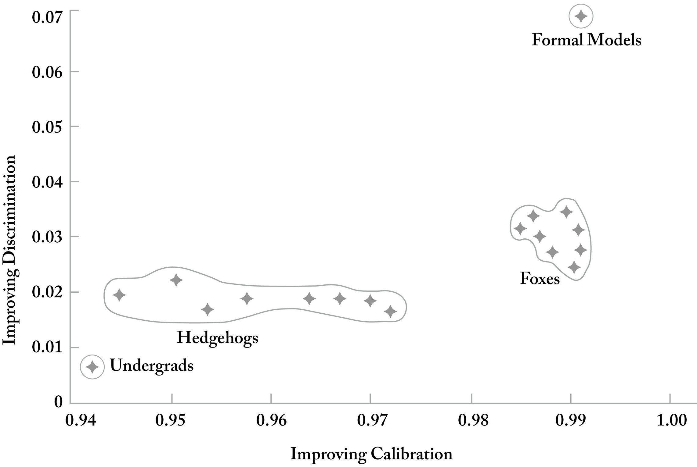

::: page_top_padding
[•]{.char-ccust4}

## []{#page_156 .pagebreak epub:type="pagebreak" role="doc-pagebreak" title="156"}第十四章 {#chapter-fourteen .para-cn-chap-pg}

## [云或时钟]{.char-ccust50} {#a-cloud-or-a-clock .para-ct}

T[[美国艺术家]{.fv-allsmallcaps}]{.char-first}托马斯·哈特·本顿（Thomas Hart Benton）在二十世纪初绘制壁画，尽管现代主义似乎正在扫除那些可以轻易解读的艺术形式，但他拒绝放弃自己的具象手法。[]{#Y_d1-EndnotePhraseInText402}他在纽约艺术学生联盟任教多年，他最著名的学生杰克逊·波洛克（Jackson Pollock）似乎对老师的影响持矛盾态度；两人有着一段漫长而纠结的友谊。[]{#Y_d1-EndnotePhraseInText403}在1944年接受《艺术与建筑》杂志采访时，波洛克对他的前导师表示了一点不情愿的赞扬，他解释说：“与他一起工作，总比与一个不那么有抵抗力的人一起工作要好。”[]{#Y_d1-EndnotePhraseInText404}本顿最初对波洛克的画布评价不高，称其为“泼洒颜料的创新”，并“鄙视其具有任何长期价值的想法”。

现代企业往往过于急于避免这种摩擦。我们今天在企业生活中享有某种安逸，一种和睦的文化，这可能会使机构偏离而非走向创造性产出。在企业和政府机构中，那种消除任何冲突迹象的冲动——甚至是急于求成——是错误的，这让许多人误以为安逸的生活在等待着他们，并奖励那些主要愿望是获得他人认可的人。[]{#Y_d1-EndnotePhraseInText405}正如喜剧演员约翰·穆拉尼（John Mulaney）所说：“讨人喜欢是一个监狱。”

回归均值、做[]{#page_157 .pagebreak epub:type="pagebreak" role="doc-pagebreak" title="157"}以前做过的事、在恰恰错误的时间从企业中消除错误类型的风险、避免对抗的随意而无情的压力无处不在，而且常常很诱人。但文化向容纳学生和员工主观现实的转变，只会加剧一些人感受到的委屈和痛苦。触发警告和其他形式的默许——左派十多年来一直热情地支持这些形式——已经产生了壮观的适得其反的效果，因为它培养了一种往往不存在的伤害感。[]{#Y_d1-EndnotePhraseInText406}威尔康奈尔医学院临床精神病学教授理查德·艾伦·弗里德曼（Richard Alan Friedman）在一次采访中说，从2016年左右开始，他开始看到学生声称自己“被不熟悉和不舒服的事物伤害”的报告有所增加，而且他们使用的语言，例如描述在课堂上听到评论时的不安，“相对于可能造成的实际伤害而言，似乎被夸大了”。

这是一个委屈产业，它有可能剥夺一代人成为这个世界全面参与者所必需的刚毅和分寸感。如果一个人希望建立任何实质性的、与众不同的东西，就必须具备一定的心理弹性和对他人意见的漠视。[]{#Y_d1-EndnotePhraseInText407}正如杰克·凯鲁亚克（Jack Kerouac）在《在路上》中所写，艺术家和创始人往往是“疯子”，“那些渴望生活、渴望交谈、渴望被拯救、同时渴望一切的人”。当然，挑战在于，一些最引人注目、最真实的不墨守成规者、艺术家和偶像破坏者，却是出了名的难相处的同事。

在创造性努力的背景下，例如科技创业公司或艺术运动，人类欲望的白板构成了一个根本性的挑战。我们本能地向他人寻求指导，以确定什么是可取的，结果，他人的意图往往被全盘采纳，不加反思，任其在我们内心滋长。法国人类学家勒内·吉拉尔（René Girard）观察到，当[]{#page_158 .pagebreak epub:type="pagebreak" role="doc-pagebreak" title="158"}一个群体中的一个成员从许多完全相同的香蕉中选择一根时，猴子之间就会出现冲突和竞争。“[]{#Y_d1-EndnotePhraseInText408}那根有争议的香蕉并没有什么特别之处，”吉拉尔在1983年的一次采访中说，“只是第一个选择者选择了它，而这个最初的选择，无论多么随意，都引发了模仿欲望的连锁反应，使那根香蕉看起来比所有其他香蕉都更可取。”

我们最早的学习经历是通过模仿。但在某个时候，这种模仿对创造力变得有毒。有些人从未完成从一种创造性婴儿期的过渡。硅谷中许多所谓的创新，当然，都算不上创新——更多的是试图复制过去行之有效或至少被认为行之有效的东西。这种模仿有时会产生结果。但更多时候，它是衍生的和倒退的。最好的投资者和创始人对这种区别很敏感，他们之所以能生存下来，是因为他们积极抵制了构建先前成功的不完美模仿的冲动。从无到有地创造某物的反叛行为——无论是从一张白纸上写一首诗，从一块画布上画一幅画，还是在屏幕上编写软件代码——根据定义，都需要拒绝以前的东西。它涉及到这样一个令人振奋的结论：新的东西是必要的。创造行为中涉及的傲慢——即认为迄今为止产生的一切，人类产出的总和，并非在特定时刻应该或需要建立的东西——存在于每个创始人或艺术家心中。[\[\*1\]](Karp_9780593798706_epub3_c014_r1.xhtml#_footnote_d1-0001c28c "footnote"){#_footnote_referrer_d1-0001c28c .char-fnref .footnote_ref .noteref epub:type="noteref" role="doc-noteref"}

对于一家初创公司，或任何试图挑战现有企业的组织来说，主导现代商业的那种盲目遵从——一种不愿冒险招致众人非议的心态——[]{#page_159 .pagebreak epub:type="pagebreak" role="doc-pagebreak" title="159"}可能是致命的。1841年，拉尔夫·沃尔多·爱默生（Ralph Waldo Emerson）发表了《自立》（Self-Reliance），这是他对宗教教条主义的持久抨击，他在其中痛斥个人在面对制度压力时的软弱。“[]{#Y_d1-EndnotePhraseInText410}对于不墨守成规，”他提醒我们，“世界会用它的不悦来鞭笞你。”爱默生明确指出，不仅渴望与周围的人保持一致，而且渴望与自己先前对某个主题的看法保持一致，同样具有限制性和束缚性。我们的思想和文字在互联网上永久存在——以及众人面对敢于进入公共生活、其先前言论被认为前后不一的个人时的热情——只会进一步将我们限制在我们昔日自我的紧身衣中。[]{#Y_d1-EndnotePhraseInText411}但爱默生问得对：“你为什么要拖着你记忆的这具尸体，唯恐你与你在这个或那个公共场所说过的话有所矛盾呢？……把你的理论，像约瑟把他的外衣留在妓女手中一样，逃走吧。”我们把自己算作那些一再逃离的人，在发现缺乏进展的几天内就放弃失败的项目，并解散功能失调的团队。在其他时候，我们当然更加胆怯，在推翻先前的判断和投资方面过于谨慎，无论是在特定的人还是项目上。但是，公众，无论是投资界还是其他方面，往往对撤退和转向、对计划的修订和失误过于不宽容。任何有意义的事情都不是一蹴而就的。需要一种贪婪的实用主义，以及一种愿意根据手头的证据调整自己对世界的看法，而不是歪曲证据。

------------------------------------------------------------------------

::: {.para-orn aria-hidden="true"}
• • •
:::

当以赛亚·伯林（Isaiah Berlin）在1953年写下他的文章《刺猬与狐狸》（The Hedgehog and the Fox）时，计算机革命还很遥远。但毫无疑问，硅谷的崛起，以及由此带来的美国的崛起，在很大程度上源于旧金山以南那片小土地的文化，在那里，一种近乎[]{#page_160 .pagebreak epub:type="pagebreak" role="doc-pagebreak" title="160"}残酷的实用主义占据了主导地位。[]{#Y_d1-EndnotePhraseInText412}对于伯林来说，我们世界上的刺猬——“他们将一切都与一个单一的中心愿景联系起来，一个或多或少连贯或清晰的系统，他们以此来理解、思考和感受”——与狐狸之间存在着“巨大的鸿沟”，狐狸“追求许多目的，这些目的往往互不相关，甚至相互矛盾，如果说有联系的话，也只是在某种事实上的方式上联系在一起”。伯林在一个极其薄弱的基础上——一行诗，一首来自公元前七世纪初出生于爱琴海中部一个岛屿上的希腊诗人阿尔基洛科斯（Archilochus）的诗的片段——建立了一些丰富而持久的东西。“[]{#Y_d1-EndnotePhraseInText413}狐狸知道很多事情，”阿尔基洛科斯写道，“但刺猬只知道一件大事。”而硅谷就是典型的狐狸。

那些已经构建并将继续构建现代世界的创始人和技术专家们，心甘情愿地放弃了宏大的理论和总体的信仰结构去构建，实际上，他们常常构建任何东西，只要它能用。技术，尤其是软件的显著特点是，它要么能运行，要么不能。在软件方面，没有中间地带，没有*差不多*。程序员会立即面临失败。再多的讨论或装腔作势也无法改变程序是否按预期执行。[]{#Y_d1-EndnotePhraseInText414}赫伯特·胡佛（Herbert Hoover）曾在斯坦福大学学习地质学，在采矿业工作了近二十年，最初是在1890年代西澳大利亚的淘金热期间，当时那里还是英国的殖民地，后来在中国天津。[]{#Y_d1-EndnotePhraseInText415}他在回忆录中写道，“与其他职业的人相比，工程师的一大责任是，他的作品都暴露在光天化日之下，人人都能看到”，而且工程师“不能像医生那样把自己的错误埋在坟墓里”，也不能“像律师那样把它们说得烟消云散或归咎于法官”。正是这种对结果和失败的敏感性，以及或许放弃了关于世界应该如何、或事物应该如何运作的宏大理论，才是一种工程文化的种子。

工程师——无论是机械[]{#page_161 .pagebreak epub:type="pagebreak" role="doc-pagebreak" title="161"}世界、数字世界，甚至可能是书面世界的工程师——都必须从他或她的理论高塔上下来，进入实际细节的泥潭，正如它们存在的那样，而不是像它们被理论化的那样。[]{#Y_d1-EndnotePhraseInText416}正如美国哲学家约翰·杜威（John Dewey）在他1922年的文章《实用主义的美国》（Pragmatic America）中所写，一个人必须“从高贵的超然中走下来，进入具体事物的泥泞溪流中”。[\[\*2\]](Karp_9780593798706_epub3_c014_r1.xhtml#_footnote_d1-00015ed9 "footnote"){#_footnote_referrer_d1-00015ed9 .char-fnref .footnote_ref .noteref epub:type="noteref" role="doc-noteref"} 对塑造系统和过程的混乱、不完美和明显矛盾的情感上和身体上的接近，是进步的源泉，而不是其障碍。[]{#Y_d1-EndnotePhraseInText418}杜威写道，对这种实用主义的承诺，或者说催生了硅谷的工程思维，“不鼓励教条主义”，“激发并鼓舞了一种实验精神，这种精神希望在完全认同之前了解系统和理论如何运作”，并且“反对过于笼统和轻易的概括”。

当前这一代人已经失去了一种贪婪的实用主义和对算计的麻木。二战结束后，美国国防和情报机构发起了一项大规模的秘密行动，招募纳粹科学家，以便在未来几年在开发火箭和喷气发动机方面保持优势。[]{#Y_d1-EndnotePhraseInText419}至少有1600名德国科学家及其家人被重新安置到美国。一些人对这种迟来的对昔日敌人的拥抱持怀疑态度。[]{#Y_d1-EndnotePhraseInText420}一位美国空军军官敦促他的指挥官抛开任何招募德国科学家为这项新事业服务的厌恶情绪，他在一封信中写道，从这些“德国出生的信息”中可以学到很多东西，只要“我们不要太骄傲”。

------------------------------------------------------------------------

::: {.para-orn aria-hidden="true"}
• • •
:::

[]{#page_162 .pagebreak epub:type="pagebreak" role="doc-pagebreak" title="162"}[]{#Y_d1-EndnotePhraseInText421}在他2005年出版的《专家政治判断》（Expert Political Judgment）一书中，宾夕法尼亚大学心理学教授菲利普·E·泰特洛克（Philip E. Tetlock）回忆说，他在1970年代看到一个演示，“让一教室的耶鲁大学本科生与一只挪威老鼠的预测能力进行较量”。挑战是确定一块食物会藏在一个小迷宫的哪一边，左边还是右边。实验者会用随机选择的方式，60%的时间把食物放在迷宫的左边，40%的时间放在右边。耶鲁大学的学生们看着老鼠试图找出食物，对可能隐藏在食物放置背后的潜在模式和宏大计划感到困惑。然而，老鼠只是想吃东西。事实证明，老鼠，而不是本科生，更善于预测食物会在哪里。

[]{#Y_d1-EndnotePhraseInText422}正如泰特洛克所解释的，在迷宫研究中，人类的思维被动物战胜了，“因为我们骨子里是决定论思想家，厌恶接受错误不可避免的概率策略”。泰特洛克承认，在任何其他领域，从物理学到医学，对宏大理论、对世界潜在系统和作用机制的探索，都为我们提供了巨大的优势。[]{#Y_d1-EndnotePhraseInText423}1902年出生于布达佩斯的理论物理学家尤金·维格纳（Eugene Wigner）曾著名地观察到“数学概念不可思议的有用性”。[]{#Y_d1-EndnotePhraseInText424}但是，同样是这种对世界系统理论的追求，对以牺牲有效混乱为代价的连贯性的追求，也给我们留下了一个持久的盲点，并抵制接受宇宙提供的教诲，即使其内部逻辑可能超出了我们的理解。

泰特洛克更广泛的兴趣和项目涉及测试政治专家在面对全球事务发展问题时所做预测的准确性。[]{#Y_d1-EndnotePhraseInText425}他和他的团队从1980年代开始，征集并汇编了专家们做出的总共27451个预测，涵盖了一系列政治问题，从[]{#page_163 .pagebreak epub:type="pagebreak" role="doc-pagebreak" title="163"}苏联的命运，南非是否会继续维持少数统治，以及魁北克是否会从加拿大分离出去。[]{#Y_d1-EndnotePhraseInText426}泰特洛克有兴趣评估他的专家小组中哪些专家能够“‘击败’投掷飞镖的黑猩猩”来预测未来的历史事件。[]{#Y_d1-EndnotePhraseInText427}事实证明，在近二十年的时间里，被选中参与泰特洛克研究的284名专家，即学者和政策专家，总的来说，表现并不比偶然好。然而，近三百名专家中的一些人确实表现出色。

泰特洛克根据专家们对有关他们如何应对智力挑战和解决问题的方式的调查问题的回答，将他的专家分成了思想家群体——狐狸和刺猬。结果是狐狸赢了。

{#page_163_img1 .fill}

[]{#page_164 .pagebreak epub:type="pagebreak" role="doc-pagebreak" title="164"}[]{#Y_d1-EndnotePhraseInText428}有很多方法可以衡量泰特洛克所说的“狐狸性”。人们可以简单地问专家他或她更认同自己是狐狸还是刺猬，同时解释以赛亚·伯林的框架。泰特洛克确实这样做了。[]{#Y_d1-EndnotePhraseInText429}但他也向专家们提出了其他问题，包括他们是否认为政治更像“云”还是“时钟”，以试图引出一些相同类型的直觉。那些将政治和历史描述为更像云而不是时钟（具有机械般的精确性和规律性）的人，结果证明是明显更好的预测者。[]{#Y_d1-EndnotePhraseInText430}根据泰特洛克的说法，“表现最差的”是“在自己的专业领域做出长期预测的刺猬极端分子”。

------------------------------------------------------------------------

::: {.para-orn aria-hidden="true"}
• • •
:::

[]{#Y_d1-EndnotePhraseInText431}在1970年代末，丰田汽车公司的高级主管大野耐一出版了一本书，描述了这家日本汽车制造商对工业制造的革新，并阐述了一种我们近二十年前采用并至今仍在使用的根本原因分析方法。这种探究方法对于我们识别公司中不可避免地出现的问题的根本原因而非表面原因至关重要。[]{#Y_d1-EndnotePhraseInText432}从表面上看，这种方法很简单：问一个问题为什么会发生，然后再问四次为什么。我们和其他人当然很有创意地称之为“五个为什么”。[]{#Y_d1-EndnotePhraseInText433}在工业制造设施的背景下，大野提供了一个例子，一台机器因为保险丝过载而停止工作，经过进一步调查，发现是由于泵损坏，最终是金属部件磨损造成的。

[]{#Y_d1-EndnotePhraseInText434}对于1912年清朝灭亡后出生于满洲里的大野来说，这种探究方法侧重于识别问题根源的工程缺陷。[]{#Y_d1-EndnotePhraseInText435}他的父亲在南满洲铁道公司工作，该公司在日本帝国在中国东北的前哨运营。识别[]{#page_165 .pagebreak epub:type="pagebreak" role="doc-pagebreak" title="165"}系统故障的原因，无论是企业软件平台还是内燃机装配线，都必然需要关注所讨论系统的内部运作和机制。

在 Palantir，我们在此探究方法的基础上，加入了对我们正在构建的软件的前身——人类系统的分析和承认。为什么企业软件平台的重要更新没有在周五的截止日期前发布？因为团队只有两天时间审查草稿代码。为什么团队只有两天时间审查？因为它在去年的预算审查周期中失去了六名软件工程师。为什么它的预算减少了？因为该部门的负责人在另一个部门负责人的要求下将优先事项转移到了别处。为什么会提出转移优先事项的要求？因为推出了一种新的薪酬模式，激励某些领域的增长超过其他领域。当然，还可以更进一步。为什么选择某些领域而牺牲其他领域？因为公司两位高级主管之间持续的宿怨。

在这个例子中，一个软件系统更新的截止日期错过了，其根本原因不是某个工程师的疏忽，甚至不是团队没有提前考虑，而是公司最高层持续且日益敌对的人际冲突。对于那些职业要求自己屈服并顺从现代企业生活变迁的人来说，这种企业蝴蝶效应绝非新鲜事。但我们发现，那些愿意追寻因果线索，并真正追随它到它所引导的地方的人，往往能解开阻碍组织前进的症结。这需要毅力和愿意超越问题的第一层去挖掘。公司领导者的心理倾向和决策直觉往往是挑战的核心。

如果参与者能够抵制将责任归咎于同事的冲动，而是专注于[]{#page_166 .pagebreak epub:type="pagebreak" role="doc-pagebreak" title="166"}导致错误的结构性——实际上往往是人际关系——问题，那么这项练习的效果最好。在过去的二十年里，我们已经进行了数千次这样的“五个为什么”审查，并起草了详细的书面报告，试图记录问题的系统性和根本原因，而不将责任归咎于个人。任何复杂系统故障的原因，无论是人为的还是其他的，往往都感觉遥不可及，因为追踪导致我们构建的机构和激励措施迷宫的多重相关因果链的困难和耐心。一个错误，例如错过的截止日期或平淡的产品发布，其根源往往在于构成参与该项事业的组织的人际关系纠结之中。这种方法是工程文化的产物，这种文化在其最佳状态下，坚定不移地专注于理解哪些做得好，哪些做得不好。挑战在于培养一种足够温和和宽容的内部文化，鼓励组织内最有才华和最正直的人站出来报告问题，而不是隐藏它们。大多数公司里的人都非常害怕失去工作，以至于任何功能失调的迹象都会被迅速掩盖起来。其他人则只是想在退休前不被发现对组织几乎没有或根本没有价值。更多的人正在将他们曾经建立的帝国的衰落货币化。

正是这种愿意回应世界本来的样子，而不是我们希望它可能的样子，才是最新一代硅谷巨头能够取得如此成就的主要原因。[]{#Y_d1-EndnotePhraseInText436}正如德国出生的具象画家卢西安·弗洛伊德（Lucian Freud）——也许是二十世纪最经久不衰的画家——所说：“我试图画出实际存在的东西。”观察的行为，即在暂停判断的同时仔细观察——接受事实并抵制将自己的观点强加于其上的冲动——是任何工程文化（包括我们的文化）的核心。1922年出生于柏林的弗洛伊德是精神分析学家西格蒙德·弗洛伊德（Sigmund Freud）的孙子，后者对人类思想的[]{#page_167 .pagebreak epub:type="pagebreak" role="doc-pagebreak" title="167"}审视改变了我们调查自己心理的意愿和能力。穿透性观察的行为对卢西安的肖像画至关重要，他将这些肖像画描述为艺术家与主题之间的一种协商。它们毫不留情，而且非常私密，既令人振奋又温柔。他长久而耐心的凝视是他作品的核心。[]{#Y_d1-EndnotePhraseInText437}英国艺术评论家马丁·盖福德（Martin Gayford）曾说，弗洛伊德“在上个世纪复兴了具象传统”，这一传统已经失宠，并有被完全取代的危险。[]{#Y_d1-EndnotePhraseInText438}这位艺术家曾告诉一位采访者：“通过非常仔细地观察某人，不加评判，你可以学到很多东西，也许还能学到关于你自己的东西。”正是这种观察方法，即在暂停评判的同时仔细观察我们周围的云，构成了工程思维的基础。我们现在面临的挑战，在重建一个技术共和国的过程中，是将这种工程本能，一种确实无情的实用主义，引向国家的共同目标，而这些目标只有在我们冒着定义我们是谁或渴望成为谁的风险时才能确定。
:::

::: {#d1-d2s10d3s6_footnotes .footnotes .footnotes epub:type="footnotes"}
[跳过注释](Karp_9780593798706_epub3_p004_r1.xhtml)

::: {#_footnote_d1-0001c28c .footnote .footnote epub:type="footnote" role="doc-footnote"}
[[\*1](Karp_9780593798706_epub3_c014_r1.xhtml#_footnote_referrer_d1-0001c28c "footnote reference"){.footnote role="doc-backlink"} ]{.footnoteNum}[]{#Y_d1-EndnotePhraseInText409}对于奥地利精神分析学家恩斯特·克里斯（Ernst Kris）来说，艺术创作涉及两个独立的过程，即引导“冲动和驱动力”，这些冲动和驱动力通常是升华的，超出了表达的范围，以及“工作”，即阐述一个想法所需的“奉献和专注”。他写于1952年的第一阶段，“其特点是被驱动的感觉，狂喜的体验，以及相信一个外部代理人通过创造者行动的信念。”
:::

::: {#_footnote_d1-00015ed9 .footnote .footnote epub:type="footnote" role="doc-footnote"}
[[\*2](Karp_9780593798706_epub3_c014_r1.xhtml#_footnote_referrer_d1-00015ed9 "footnote reference"){.footnote role="doc-backlink"} ]{.footnoteNum}[]{#Y_d1-EndnotePhraseInText417}杜威以实用主义“诞生于美国土壤”而自豪。
:::
:::
