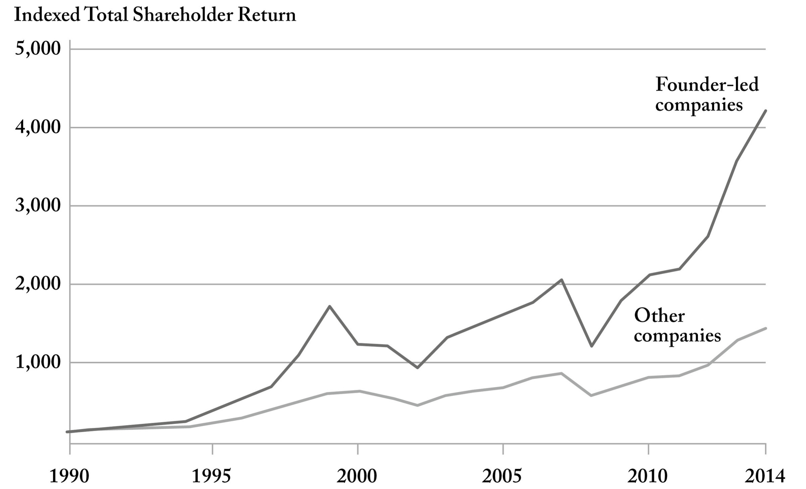

::: page_top_padding
[•]{.char-ccust4}

## []{#page_205 .pagebreak epub:type="pagebreak" role="doc-pagebreak" title="205"}第十八章 {#chapter-eighteen .para-cn-chap-pg}

## [审美视角]{.char-ccust50} {#an-aesthetic-point-of-view .para-ct}

1969年，电视连续剧《文明》在英国播出，这部宏大而雄心勃勃的艺术史记述从古罗马一直讲到中世纪的法国以及更远的时期，吸引了全国家家户户的目光。超过两百万人观看了该节目。一些教区的教堂礼拜为了确保人们能看到该节目而重新安排了时间。节目的主持人肯尼斯·克拉克于1903年出生在伦敦，是另一个时代的产物，他毫不掩饰自己的贵族身份；他提供了一种看似连贯的叙事，讲述了西方艺术走向美丽与伟大的进程。在战后的英国和美国，他的世界观对许多人来说是令人慰藉的，并且是刻意不合时宜的。克拉克对一位艺术家的作品价值或一个时代的审美成就的判断具有法律法令的力量。十六世纪罗马的绘画在他看来是“软弱、矫揉造作”和“自我意识过强”的。

对克拉克来说，有高雅和低俗之分，文明正在或至少应该朝着更伟大的方向前进。他将一个未指明其非洲大陆原产国的非洲面具与梵蒂冈的阿波罗·贝尔维德雷像进行比较，并以特有的自信断言：“阿波罗比面具体现了更高的文明状态。”在其他地方，他以一种令人振奋的轻蔑态度，拒绝给予西班牙在英国作家兼历史学家玛丽·比尔德在2016年回忆起几十年前首次接触该系列片时的情景，她说她开始“对克拉克的贵族式自信和‘伟人’式的艺术史研究方法——一个该死的天才接着另一个——感到非常不舒服”。克拉克所说的很多话在今天都说不出口了。但在我们急于反抗对西方艺术和历史的狭隘叙述的压迫时，我们可能剥夺了自己比预期更多的东西。像克拉克这样的不合时宜之物的被扫除，恰逢其他规范和审美框架的被抛弃。结果，我们无意中削弱了我们辨别乃至判断的能力。

即使是今天，像专栏作家佩吉·努南对最近一部戏剧作品的抨击那样，温和地援引美的尝试——称其为“丑陋、怪异、不艺术”——现在也充满了争议和抵制。艺术批评的重塑，对克拉克存在方式的挑战，是煤矿里的金丝雀。艺术可能是第一个，但接下来还有更多。品味和更广泛的审美偏好表达——实际上，在某些情况下，任何偏好的暗示——都被视为分裂性的，仅仅是精英情感的表达而被回避。正如大卫·丹比在1997年《纽约客》的一篇文章中所写，“审美趣味”现在有被斥为仅仅是“追求地位的行为”的产物的风险。当然，据称中立或无辜的审美决定往往是构建和维持种姓等级制度的手段。美国社会学家[](#page_207 .pagebreak epub:type="pagebreak" role="doc-pagebreak" title="207"}索尔斯坦·凡勃伦在1899年观察到，英国精英们僻静乡间庄园里“迂回”的车道，其多余的弯曲，是表达权力的一种方式。但在我们的审美生活中，难道就没有什么值得保留的，没有南北之分吗？

我们集体和当代对就真理、美、美好生活乃至正义提出主张的恐惧，使我们拥抱了一种单薄的集体认同，这种认同无法为人类经验提供有意义的指导。现在所有文化都是平等的。批评和价值判断是被禁止的。然而，这一新的教条掩盖了一个事实，即某些文化乃至亚文化，包括硅谷的规范和组织习惯，尽管有其缺陷和矛盾，却创造了奇迹。其他的则被证明是平庸的，更糟糕的是，是倒退和有害的。我们或许有理由对为了阿波罗的白色大理石而草率地抛弃那个无名的“非洲面具”感到反感。但是，难道我们就应该没有任何方法来辨别推动我们前进的艺术、促进人类事业的思想和那些做不到的吗？风险在于，我们害怕宣告、害怕说话、害怕偏爱，使我们在调动我们共享的资源和才能时失去了方向和信心。恐惧使我们退缩，缩小了我们对可能性的感觉，而这种恐惧已经渗透到我们生活的方方面面。

这种对审美观点的放弃对构建技术是致命的。软件的构建需要品味，既体现在制作相关程序上，也体现在挑选构建它们所需的人才上。它既是一门艺术，也是一门科学。硅谷从圣克拉拉县的一小块土地上崛起，建设得如此之多、如此之快，部分原因在于它为世界上的克拉克们保留了空间。创始人有审美观点。他们的专长可能不是十九世纪的雕塑或意大利的湿壁画，但他们在硅谷找到了一个空间，允许他们行使本质上是一种艺术形式的判断，并在一个{#_footnote_referrer_d1-0001c314 .char-fnref .footnote_ref .noteref epub:type="noteref" role="doc-noteref"}](../images/013_Karp_9780593798690_all_art_r2.jpg){#page_208_img1 .fill}

对单一路径或观点的承诺，以及对自己选择的限制，有时可能是驾驭当奥德修斯要求他的船员在他驶过塞壬及其迷人歌声时将他绑在船的桅杆上时，他警告他的手下，“如果我恳求你们，并命令你们放开我，”那么“用更多的镣铐把我绑得更紧。”他是有意限制自己的活动范围，他应对外部世界的能力，以及被其迷人乃至致命的诱惑所转移的风险。行动的自由，随心所欲地操纵，可以伪装成权力的模仿。愿意约束选择，将自己投向桅杆，通常是公司或文化进行创造性生产的最佳，如果不是唯一途径。

------------------------------------------------------------------------

::: {.para-orn aria-hidden="true"}
• • •
:::

创始人领导的公司表现优于其他公司，这一点有越来越多的证据支持，这是优先考虑审美观点、给予宣告和决定空间的结果。这种经济上的优异表现对许多人来说是极其违反直觉，甚至是令人困惑的。由委员会统治，对管理层进行更多监督和控制的公司，根据自由市场的教义问答，应该随着时间的推移变得更有效率和效果。然而，证据表明并非如此。

瑞士洛桑联邦理工学院的金融学教授吕迪格·法伦布拉赫编制了一份包含2327家美国公司的名单，时间跨度为1992年至2002年的十年，其中361家由创始人而非专业或任命的首席执行官经营。他发现，一种仅购买创始人经营公司股票的投资方法，即使在控制了包括行业和企业年龄在内的各种其他因素后，也能获得10.7%的超额年回报率，或比包含所有公司（创始人经营和其他公司）的投资组合每年多出4.4%。在家族企业中也观察到了类似的结果，但法伦布拉赫的研究他得出结论，“创始家族后代的大量持股”本身不足以影响公司在市场上的价值；相反，是那些由创始人掌舵的公司随着时间的推移可靠地表现优于其他公司。

{#page_210_img1 .fill}

其他人也观察到了类似的结果。普渡大学的一组研究人员对标准普尔500指数中的500家公司进行了调查，该指数是美国最大和最重要的企业指数，时间跨度为1993年至2003年的十年，以确定创始人领导的公司是否产生了更多的创新，创新以被他人广泛引用的专利来衡量。研究人员感兴趣的不仅仅是专利申请的提交，而是随着时间的推移，在普渡大学的团队发现，与专业首席执行官相比，由创始人领导的公司拥有多出31%的重要专利。

这种优异表现绝非偶然。追求创新与工程执行的严谨相结合，需要一定程度的与外界隔绝，需要一些保护，以抵御市场的本能和常常是错误的引导。委员会创造不出任何实质性的东西，当然也创造不出任何持久的东西。我们的挑战，无论是在美国还是在更广泛的西方，都将是驾驭和引导这一新一代创始人的创造力，这些技术偶像，为超越其个人利益的东西服务。

必须允许和鼓励一种所有权文化在我们的社会中扎根。大卫·斯文森，耶鲁大学捐赠基金的前投资主管，在该组织掌舵三十五年。他谈到投资这所成立于1701年的大学的资源，是为了确保学校不是几年甚至几十年的强劲表现，而是再存在三个世纪。对斯文森来说，“短期主义”和市场“对季度收益的关注”是“极具破坏性的”，正如他在2017年的一次采访中所说。相反，是一种管家精神，一种对资产的临时和有条件的拥有，才能够长期保持其价值。

硅谷的核心优势之一是它对所有权社会的拥抱——尽管这种拥抱不完美、断断续续、充满矛盾——在这个制度中，组织内部的劳动力、创造性人才，在他们正在建设的企业的成功和成果中拥有重大的利害关系。人们很容易忘记，在一家科技公司，从行政助理到高管，向所有员工授予股权的行为，在20世纪90年代是一项激进的举措，它背离了当时流行的模式，即组织员工按小时计酬或领取薪水，而所有者则获得超额回报。少数其他行业曾尝试过共享所有权模式，早期的参与者共同承担风险和回报。硅谷仍然是世界上为数不多的地方之一，在那里，出身低微的人，用宪法学者阿基尔·里德·阿马尔的话说，可以拥有一些实质性的东西，并分享他们劳动的成果，而不是在别人的企业中充当齿轮，即使通常是高薪的齿轮。在整个20世纪80年代和90年代，一个有才华的毕业生或许可以加入高盛，高盛是合伙人薪酬模式的先驱，或者是一家白鞋律师事务所，那里的律师分享他们工作的利润和风险。但这些实验基本上已经凋零；这样的公司仍然吸引着有才华和雄心勃勃的人才，但他们得到的是薪水，通常是高薪，但仍然是薪水。劳动力的努力和创造性能量的成果被资本家攫取。

------------------------------------------------------------------------

::: {.para-orn aria-hidden="true"}
• • •
:::

1934年，鲁思·本尼迪克特出版了《文化模式》，书中她讲述了自己在加拿大西部、美拉尼西亚和美国西南部与前工业社会一起生活和研究的经历。她描述了努力实现“一种更现实的社会信念”，这种信念解释了人类文化和文化实践的多样性。但她更进一步，描述了“人类从生存的原材料中为自己创造的共存且同样有效的生活模式”。正是她提到的“同样有效”的文化，引发了一个世纪的讨论和辩论。对于几代人类学家来说，研究前工业社会成了一种提升{#_footnote_referrer_d1-00015ef7 .char-fnref .footnote_ref .noteref epub:type="noteref" role="doc-noteref"}

现代形式的硅谷是这种思想传统的产物，是一种文化和道德上的不可知论，如果不是相对主义的话，它刻意回避任何接近于关于美好生活的实质性观点。过去十年在硅谷盛行并由哲学家彼得·辛格等人推动的有效利他主义运动，试图建立在伦理普遍主义的直观吸引力之上——即所有人类，乃至一些非人类，都应被纳入我们的道德考量。辛格出生于澳大利亚墨尔本，在普林斯顿大学任教二十多年，他的工作之所以吸引人，是因为它似乎解决了这个难题：福祉，无论是人类还是海獭的，才是最重要的。但这种方法为一代人提供了一个借口，让他们可以回避更棘手的问题，比如什么是美好的生活，国家认同的界限和内容，以及人类对意义的追寻。英国哲学家罗杰·斯克鲁顿批评辛格采纳了“一种空洞的功利主义”，其优雅和简洁虽然诱人，但却将经验简化为单一的衡量标准。硅谷许多领先公司的创始人并非*不道德*，从这个意义上说；他们只是*非道德*的，对宏大的信仰结构和世界观以及对集体生活可以或应该是什么的肯定性概念持怀疑态度。

硅谷的企业家们并不缺乏理想主义；事实上，他们似乎常常充满了理想主义。但这种理想主义是单薄的，在利奥·施特劳斯于19世纪末出生于普鲁士，曾在芝加哥大学任教，他认为，在许多方面，对道德观点的拒绝是启蒙运动乃至使硅谷成为可能的科学革命的先决条件，他写道，“道德上的迟钝”，即放弃或至少暂停对善恶定义的探寻，“是科学分析的必要条件”。他也很早就观察到，在实践中，科学和道德之间的这种清晰划分要困难得多——“被禁止从政治学、社会学或经济学的前门进入的价值判断，却从这些学科的后门进入”。对施特劳斯来说，当代的社会科学家为了追求真理而拒绝了价值观，并说服自己这种区分是可能的。但正是这种“对任何目标的漠不关心，或漫无目的和漂泊”，正如施特劳斯所说，是我们当前文化虚无主义的种子。

成群的硅谷企业家和工程师是前一代学者的继承者，这些学者试图躲在据称中立的科学发现追求背后。强制的中立，首先是在学院和大学，后来是在构建了我们现在都生活在其中的世界的科技公司内部，给我们留下了一个空洞的对李光耀来说，理想的抱负是成为孔子在两千多年前所敦促的*君子*，这个词被不同地翻译为“模范人物”或“绅士”。李光耀在一次采访中说，这是一个“孝顺父母”、“忠于妻子”、“善于抚养子女”并且是“皇帝的忠诚公民”的人。对今天许多人来说，这种对美德的具体概念必须被抵制，因为它狭隘和排外。但是，在我们以包容的名义抛弃了旧的美德之后，我们愿意提出和捍卫什么样的美德，什么样的崇高或模范生活的概念呢？

帝国的衰落之前也曾伴随着对美德追求和培养的放弃。生于公元前86年的罗马历史学家萨卢斯特记录了他周围共和国的衰落，当时喀提林企图发动政变，后来被罗马军队杀死。萨卢斯特写道，“由于财富的缘故，年轻人突然被奢侈和贪婪以及傲慢所吞噬。”他们对自己致富之外的任何事情都变得不感兴趣。一种平淡乏味的功利主义不足以补救当前的萎靡不振。有效的利他主义者在借用道德哲学的语言方面很精明，但他们的举动只是推迟了对人类寻求意义的清算。正如1985年创办《国家利益》的欧文·克里斯托尔所写，“我们文明今天面临的微妙任务不是改革世俗的、理性主义的正统观念”，而是“为那些现在基本上处于昏迷状态的、更古老的宗教正统观念注入新的活力”。

正是在这里，建制派左翼辜负了它的事业，并如此彻底地侵蚀了它的潜力。对一种肤浅的{#_footnote_referrer_d1-00015efb .char-fnref .footnote_ref .noteref epub:type="noteref" role="doc-noteref"}我们现在必须认真考虑这样一种可能性，即能够让我们继续生存和凝聚的，将是共享文化的复兴，而不是其放弃。

正是对集体经验和努力的厌恶，使美国和美国文化容易受到攻击和渗透。我们被训练得如此小心，如此不愿谈论美国文化的内容，如果有什么的话，以至于文化生产和制造的行为迁移到了其他不那么敌对的领域。目前，美国社会共享的主要特征不是公民或政治的，而是围绕娱乐、体育、名人和时尚凝聚在一起。这不是某些无法弥合的政治分歧的结果。使在一个相当大的群体中陌生人之间形成一种想象的亲密关系成为可能的人际纽带，被切断并从公共领域中驱逐出去。制造一个国家的旧方法，即教育系统的公民仪式、国防义务兵役、宗教、共同语言和繁荣自由的媒体，都已几乎被拆除或因忽视和滥用而凋零。

硅谷抓住了美国国家经验中出现的空白所创造的机会。那些已经开始主宰我们生活的科技公司，在许多情况下都是小[](#page_217 .pagebreak epub:type="pagebreak" role="doc-pagebreak" title="217"}国家，建立在一套许多年轻人渴望的理想之上：建设的自由、对自己成功的拥有权，以及最重要的是对结果的承诺。森尼韦尔、帕洛阿尔托和山景城这些地方都是公司城镇和城邦，与社会隔绝，并提供国家项目再也无法提供的东西。

我们的论点是，前进的道路将涉及对自由市场的承诺及其对个人需求和欲望的原子化和孤立，与人类对某种形式的集体经验和努力的永不满足的渴望之间的和解。硅谷提供了后者和前者的回报。在圣克拉拉县的城镇、公司和其他地方，一种现代的艺术殖民地或技术公社如雨后春笋般涌现。这些是内部连贯的社区，其公司园区试图满足日常生活的所有需求和欲望。它们的核心是集体主义的努力，由思想极其个人主义和自由的人们组成。诚然，硅谷公司所兜售的公共体验本身也商品化了。然而，美国和更广泛的西方日常生活的原子化为科技公司（包括我们公司）留出了一条通道，以招募和留住一代想要做一些不同于摆弄金融市场或咨询的人才。

其他国家，包括我们的许多地缘政治对手，都明白肯定共同的文化传统、神话和价值观在组织人民努力方面的力量。他们在承认人类对公共体验的需求方面远没有我们那么害羞。培养一种过于强硬和不假思索的民族主义有其风险。但拒绝任何形式的共同生活也有风险。在美国和其他地方重建一个技术共和国，将需要重新拥抱集体经验、共同目标和身份，以及能够将我们联系在一起的公民仪式。我们正在建设的技术，包括可能挑战我们

::: {#_footnote_d1-0001c314 .footnote .footnote epub:type="footnote" role="doc-footnote"}
[[\*1](Karp_9780593798706_epub3_c018_r1.xhtml#_footnote_referrer_d1-0001c314 "footnote reference"){.footnote role="doc-backlink"} ]{.footnoteNum}[]{#Y_d1-EndnotePhraseInText543}一位艺术史学家指出，虽然塞壬在古希腊和罗马艺术品中最初被构想为“长着女人脸的鸟”，描绘的是荷马《奥德赛》中的场景，但她们最终在中世纪与美人鱼“混为一谈”。
:::

::: {#_footnote_d1-00015ef7 .footnote .footnote epub:type="footnote" role="doc-footnote"}
[[\*2](Karp_9780593798706_epub3_c018_r1.xhtml#_footnote_referrer_d1-00015ef7 "footnote reference"){.footnote role="doc-backlink"} ]{.footnoteNum}[]{#Y_d1-EndnotePhraseInText553}这个民族志时代的自负之处在于，被研究的民族被认为是固定在时间里的，基本上缺乏在历史中移动或发展的能力。玛格丽特·米德是本尼迪克特的学生之一，她是那一代文化人类学家中的一员，她在1928年出版的《萨摩亚的成年》中，用被描述为“民族志现在时”的方式来叙述她所写的年轻女性和其他人的生活。她的研究对象不仅与世界隔绝，而且“在语法上被冻结在她观察到他们的那一刻——*游泳*、*吃饭*、*讲述*、*知道*”，正如作家查尔斯·金所指出的那样。
:::

::: {#_footnote_d1-00015efb .footnote .footnote epub:type="footnote" role="doc-footnote"}
[[\*3](Karp_9780593798706_epub3_c018_r1.xhtml#_footnote_referrer_d1-00015efb "footnote reference"){.footnote role="doc-backlink"} ]{.footnoteNum}[]{#Y_d1-EndnotePhraseInText563}约翰·罗尔斯认为，政治自由主义保持“目标中立”的愿望，并不排除它“仍然可以肯定某些道德品质形式的优越性并鼓励某些道德美德”的可能性。但他的美德清单，包括“公平的社会合作”、“文明”、“宽容”和“合理性”，已被证明是有限和温和的——基本上是公民社会运作的一系列无可非议的背景要求，不允许公共生活中有任何丰富性或文化特殊性。
:::
:::
